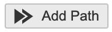
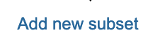
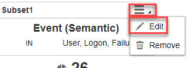
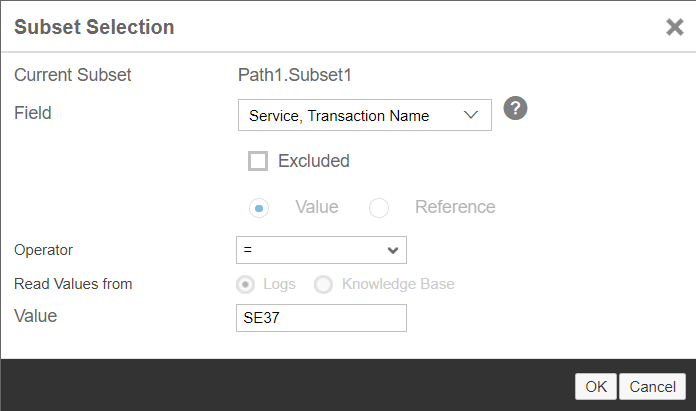
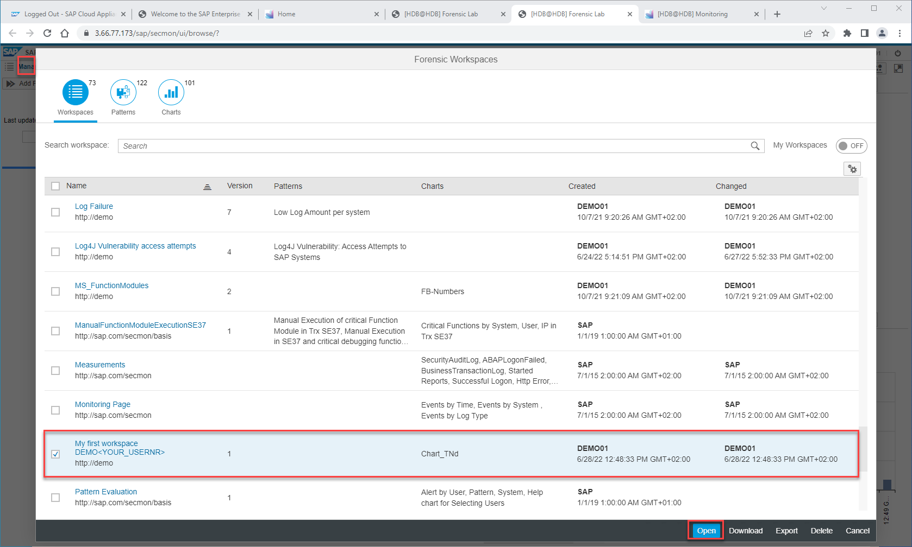
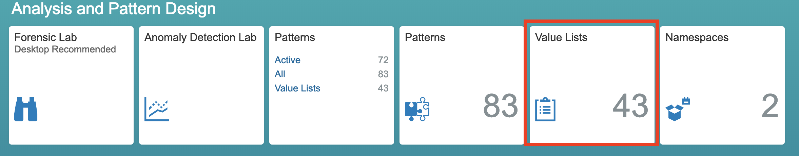

**Secure the Intelligent Enterprise with SAP Enterprise Threat
Detection**

**Exercise: Working with SAP Enterprise Threat Detection**

**Version TechEd 2023**

**Based on SAP Enterprise Threat Detection Version 2, Support Package
5**

Table of ContentS

[1. ETD User -- ETD Roundtrip and Navigation
[3](#etd-user-etd-roundtrip-and-navigation)](#etd-user-etd-roundtrip-and-navigation)

[1.1. Start Page and Navigation to different tiles
[3](#start-page-and-navigation-to-different-tiles)](#start-page-and-navigation-to-different-tiles)

[1.2. Summary [22](#summary)](#summary)

[2. Security Expert - Working with the Forensic Lab
[22](#security-expert---working-with-the-forensic-lab)](#security-expert---working-with-the-forensic-lab)

[2.1. Filtering Data [23](#filtering-data)](#filtering-data)

[2.2. Modelling Charts [25](#modelling-charts)](#modelling-charts)

[2.3. Browse through the data and model your own individual charts
[28](#browse-through-the-data-and-model-your-own-individual-charts)](#browse-through-the-data-and-model-your-own-individual-charts)

[2.4. Working with Value Lists
[30](#working-with-value-lists)](#working-with-value-lists)

[2.5. Modeling Attack Detection Patterns
[31](#modeling-attack-detection-patterns)](#modeling-attack-detection-patterns)

[2.1. Summary [36](#summary-1)](#summary-1)

[3. ProcessING alerts and investigations
[36](#processing-alerts-and-investigations)](#processing-alerts-and-investigations)

[3.1. Viewing Alerts [37](#viewing-alerts)](#viewing-alerts)

[3.2. Investigating Alerts
[40](#investigating-alerts)](#investigating-alerts)

[3.3. Saving Evidence for Attacks
[49](#saving-evidence-for-attacks)](#saving-evidence-for-attacks)

[3.4. Summary [50](#summary-2)](#summary-2)

[4. Pseudonymization of User Data
[50](#pseudonymization-of-user-data)](#pseudonymization-of-user-data)

[4.1. Determining the True Identity of Users
[50](#determining-the-true-identity-of-users)](#determining-the-true-identity-of-users)

[4.2. Logging Access to User Identities
[53](#logging-access-to-user-identities)](#logging-access-to-user-identities)

[4.1. Summary [53](#summary-3)](#summary-3)

[5. Monitoring DashboardS
[53](#monitoring-dashboards)](#monitoring-dashboards)

[5.1. Viewing Default Monitoring Dashboard
[53](#viewing-default-monitoring-dashboard)](#viewing-default-monitoring-dashboard)

[5.2. Building your own Monitoring Dashboard
[55](#building-your-own-monitoring-dashboard)](#building-your-own-monitoring-dashboard)

[5.1. Summary: [57](#summary-4)](#summary-4)

[ETD Demo Users]{.underline}

-   Usernames: Demo01, ..., Demo29: You get your User ID in the room

-   Password: Welcome0

In this exercise replace **\<YOUR_USERNR\>** with your user number:

-   DEMO**01** DEMO**ONE**

-   DEMO**02** DEMO**TWO**

-   ....

-   DEMO**10** DEMO**TWENTYNINE**

Make use of the following pattern name for your own created content
(Charts, Patterns, Value-Lists, etc.) in this session:

***\<Chart name\>*** DEMO***\<YOUR_USERNR\>***

# ETD User -- ETD Roundtrip and Navigation

**Tool Aspect**: In this Exercise you as an ETD User will be able to
navigate through the most important UIs of SAP Enterprise Threat
Detection. You will get knowledge about different UIs like Monitoring,
Alerts, Forensic Lab, Settings, (De-)Pseudonymization, Patterns, Value
Lists, etc.

## Start Page and Navigation to different tiles

In this Exercise you will open the start page and click on several tiles
to navigate forth and back

+----------------------------+-----------------------------------------+
| Explanation                | Screenshot                              |
+============================+=========================================+
| 1.  After Logging on you   | {width="3.921527777777778in" |
|     In this exercise you   | height="3.9833333333333334in"}          |
|     will click on each of  |                                         |
|     the red marked tiles   |                                         |
|     to have a 1^st^ look   |                                         |
|     what's in there.       |                                         |
+----------------------------+-----------------------------------------+
| 2.  Click on Tile          | {width="1.5834700349956254in" |
|                            | height="1.7918219597550307in"}          |
+----------------------------+-----------------------------------------+
| 3.  The Default Monitoring | {width="3.921527777777778in" |
|                            | height="1.8902777777777777in"}          |
+----------------------------+-----------------------------------------+
| 4.  Click on the small     | {width="1.7554702537182851in" |
|     right corner and       | heig                                    |
|     select another         | ht="0.5576946631671041in"}{width="1.5499179790026247in" |
|     Alert Statistics).     | height="1.9101891951006125in"}          |
|     Another Monitoring     |                                         |
|     page will be shown. In |                                         |
|     a later exercise you   |                                         |
|     will learn how to      |                                         |
|     create own monitoring  |                                         |
|     pages with own charts. |                                         |
+----------------------------+-----------------------------------------+
| 5.  Jump back to the       | {width="1.1334317585301836in" |
|     upper left arrow or    | height="0.9167465004374453in"}          |
|     the home button.       |                                         |
+----------------------------+-----------------------------------------+
| 6.  In Tile Patterns,      | {width="1.4417913385826773in" |
|     'All' or 'Active'.     | height="1.408455818022747in"}           |
+----------------------------+-----------------------------------------+
| 7.  You see the list of    | {width="3.921527777777778in" |
|     their current state,   | height="0.9229166666666667in"}          |
|     and how many alerts    |                                         |
|     they raised.           |                                         |
+----------------------------+-----------------------------------------+
| 8.  You can jump to the    | {width="3.921527777777778in" |
|     pattern, by clicking   | height="2.172222222222222in"}           |
|     on the pattern name in |                                         |
|     the list.              |                                         |
+----------------------------+-----------------------------------------+
| 9.  When clicking on       | {width="3.974297900262467in" |
|     of the pattern can be  | height="0.9768591426071741in"}          |
|     changed, e.g.:         |                                         |
|                            |                                         |
|     a.  Run frequency      |                                         |
|                            |                                         |
|     b.  Severity           |                                         |
|                            |                                         |
|     c.  Status             |                                         |
|         (Active/Inactive)  |                                         |
|                            |                                         |
|     d.  Threshold          |                                         |
|                            |                                         |
|     e.  Test Mode Checkbox |                                         |
|                            |                                         |
| You can save via using the |                                         |
| 'Save' button              |                                         |
+----------------------------+-----------------------------------------+
| 10. When clicking on the   | {width="3.6169805336832894in" |
|     Forensic Lab opens and | height="0.6417224409448818in"}          |
|     you can see the        |                                         |
|     modeling of the        |                                         |
|     patterns, as it is     |                                         |
|     delivered by SAP. The  |                                         |
|     Forensic Lab will be   |                                         |
|     explained in a         |                                         |
|     separate part of this  |                                         |
|     exercise, and in other |                                         |
|     exercises about        |                                         |
|     modeling own use       |                                         |
|     cases.                 |                                         |
+----------------------------+-----------------------------------------+
| 11. Click the Home button  | {width="0.9917530621172354in" |
|     launch pad.            | height="0.6417224409448818in"}          |
+----------------------------+-----------------------------------------+
| 12. Klick on Tile 'Value   | {width="1.4417913385826773in" |
|                            | height="1.3917869641294838in"}          |
+----------------------------+-----------------------------------------+
| 13. You see the list       | {width="3.921527777777778in" |
|     lists. A value list    | height="1.8652777777777778in"}          |
|     can act as a           |                                         |
|     block-list or as an    |                                         |
|     allow list. They are   |                                         |
|     used as filter         |                                         |
|     elements in patterns,  |                                         |
|     all list entries are   |                                         |
|     used to filter based   |                                         |
|     on these value list    |                                         |
|     entries in an          |                                         |
|     inclusive or exclusive |                                         |
|     way.                   |                                         |
|                            |                                         |
| > Value lists can          |                                         |
| > automatedly updated from |                                         |
| > outside via a rest       |                                         |
| > endpoint, if Checkbox    |                                         |
| > 'Automated' is switched  |                                         |
| > on.                      |                                         |
| >                          |                                         |
| > Values can be added by   |                                         |
| > customers ('Add'), or    |                                         |
| > SAP delivered values can |                                         |
| > be removed ('Remove      |                                         |
| > Selected'). The changes  |                                         |
| > to standard value lists  |                                         |
| > are not overwritten by   |                                         |
| > updates.                 |                                         |
+----------------------------+-----------------------------------------+
| 14. Go back to launch pad  | {width="2.4168766404199475in" |
|                            | height="0.6500568678915135in"}          |
+----------------------------+-----------------------------------------+
| 15. Klick on Tile 'Threat  | {width="1.4417913385826773in" |
|                            | height="1.4751279527559056in"}          |
+----------------------------+-----------------------------------------+
| 16. The UI shows the       | {width="3.921527777777778in" |
|     Users, Systems,        | height="1.60625in"}                     |
|     Patterns, Alerts, End  |                                         |
|     User Machine           |                                         |
|     Hostnames. The bigger  |                                         |
|     a circle, the more an  |                                         |
|     entity is involved     |                                         |
|     into the correlations. |                                         |
|     E.g. in the Screenshot |                                         |
|     the User Pseudonym     |                                         |
|     HRLP_7900 is involved  |                                         |
|     in 9 different Alerts, |                                         |
|     based on two patterns. |                                         |
|                            |                                         |
| > By that it can be easily |                                         |
| > found out where there    |                                         |
| > are hot spots of Alerts, |                                         |
| > Suspicious Activities or |                                         |
| > cyber Attacks            |                                         |
| > correspondingly.         |                                         |
| >                          |                                         |
| > By hovering over an      |                                         |
| > Alert, you can as well   |                                         |
| > jump to the detailed     |                                         |
| > Alert list               |                                         |
+----------------------------+-----------------------------------------+
| 17. You can toggle between | {width="1.675145450568679in" |
|     graphical view and the | height="0.7834011373578302in"}          |
|     detailed Alert list by |                                         |
|     clicking on the list   |                                         |
|     button (and back from  |                                         |
|     the list)              |                                         |
+----------------------------+-----------------------------------------+
| 18. In the alert list, you | {width="3.921527777777778in" |
|     alerts with already    | height="1.6027777777777779in"}          |
|     some alert triggering  |                                         |
|     information in the     |                                         |
|     column 'Trigger'. From |                                         |
|     here you can jump to:  |                                         |
|                            |                                         |
|     a.  The Alert itself,  |                                         |
|         with more detailed |                                         |
|         descriptions.      |                                         |
|                            |                                         |
|     b.  The Pattern        |                                         |
|         description, as    |                                         |
|         you find it in the |                                         |
|         Tile 'Patterns'    |                                         |
|                            |                                         |
|     c.  The triggering     |                                         |
|         Events, when       |                                         |
|         clicking on the    |                                         |
|         Link 'Events' in   |                                         |
|         the 'Trigger'      |                                         |
|         Description. This  |                                         |
|         is as well         |                                         |
|         possible from the  |                                         |
|         opened single      |                                         |
|         alert              |                                         |
+----------------------------+-----------------------------------------+
| 19. In order to process    | {width="2.3585378390201224in" |
|     several alerts         | height="0.3083595800524934in"}          |
|     belonging together     |                                         |
|     (i.e. having the same  |                                         |
|     root cause) and start  |                                         |
|     an investigation (or   |                                         |
|     add to an existing     |                                         |
|     investigation).        |                                         |
|                            |                                         |
| > An investigation is the  |                                         |
| > evidence collection      |                                         |
| > object in ETD. It will   |                                         |
| > be used for collecting   |                                         |
| > all corelated alerts,    |                                         |
| > screenshots, documents,  |                                         |
| > single logs, snapshots,  |                                         |
| > etc., and finally        |                                         |
| > provide a state and      |                                         |
| > potential resolvement.   |                                         |
| > Alert and investigation  |                                         |
| > handling is a separate   |                                         |
| > exercise.                |                                         |
+----------------------------+-----------------------------------------+
| 20. Click on one of the    | {width="3.921527777777778in" |
|     the Alert details.     | height="2.545138888888889in"}           |
|     From here you can jump |                                         |
|     to:                    |                                         |
|                            |                                         |
|     a.  the pattern        |                                         |
|         definition         |                                         |
|                            |                                         |
|     b.  the pattern        |                                         |
|         workspace in the   |                                         |
|         forensic lab. The  |                                         |
|         time frame then    |                                         |
|         filters            |                                         |
|         automatically to   |                                         |
|         the time when the  |                                         |
|         alert was raised,  |                                         |
|         so you can see the |                                         |
|         log events at time |                                         |
|         of the raising of  |                                         |
|         the alert.         |                                         |
|         Forensic Lab will  |                                         |
|         be part of another |                                         |
|         exercise           |                                         |
|                            |                                         |
|     c.  the triggering     |                                         |
|         events, so you can |                                         |
|         see the detailed   |                                         |
|         normalized and     |                                         |
|         original log data  |                                         |
|         that was analyzed  |                                         |
|         to raise the       |                                         |
|         alert. Alert       |                                         |
|         handling is part   |                                         |
|         of another         |                                         |
|         excercise          |                                         |
|                            |                                         |
|     d.  the related        |                                         |
|         events, by         |                                         |
|         filtering on the   |                                         |
|         alert raising time |                                         |
|         frame, and         |                                         |
|         different          |                                         |
|         available          |                                         |
|         correlating        |                                         |
|         attributes (e.g.   |                                         |
|         user, system ,...) |                                         |
|                            |                                         |
| Additionally you can see   |                                         |
| the Severity (Low, Medium, |                                         |
| High, Very High) and a     |                                         |
| Score. The Pattern related |                                         |
| default severity can be    |                                         |
| automatedly raised if the  |                                         |
| system is a critical       |                                         |
| system related to          |                                         |
| confidentiality, integrity |                                         |
| and availability. The      |                                         |
| Score multiplies the       |                                         |
| pattern criticality        |                                         |
| (related to                |                                         |
| confidentiality, integrity |                                         |
| and availability) with the |                                         |
| system criticality related |                                         |
| to attacks against         |                                         |
| confidentiality, integrity |                                         |
| and availability. It can   |                                         |
| vary between 0 and 100.    |                                         |
+----------------------------+-----------------------------------------+
| 21. Go back to the Alert   | {width="0.7378827646544182in" |
|     the 'back' arrow. Then | height="0.617412510936133in"}           |
|     go back to the launch  | {width="0.9917530621172354in" |
|     to the 'back' arrow or | height="0.6417224409448818in"}          |
|     to the home-button     |                                         |
+----------------------------+-----------------------------------------+
| 22. Click on Tile          | {width="1.450125765529309in" |
|                            | height="1.3584514435695538in"}          |
+----------------------------+-----------------------------------------+
| 23. You can choose between | {width="3.921527777777778in" |
|                            | height="1.4333333333333333in"}          |
| The list of 'Semantic      |                                         |
| Events' shows all events   |                                         |
| in a human understandable  |                                         |
| wording and with a short   |                                         |
| explanation. The semantic  |                                         |
| events are very often      |                                         |
| translations from a        |                                         |
| technical event ID. E.g.   |                                         |
| the technical Event AU1    |                                         |
| from a SAP Security Audit  |                                         |
| Log is translated to User, |                                         |
| Logon. The semantic events |                                         |
| are used in the forensic   |                                         |
| lab to be filtered on.     |                                         |
| Additional semantic events |                                         |
| can be created by          |                                         |
| customers to be used when  |                                         |
| ingesting own log data,    |                                         |
| that needs to be           |                                         |
| normalized (learned)       |                                         |
|                            |                                         |
| The list of 'Attributes'   |                                         |
| shows all normalized       |                                         |
| attributes in the Event    |                                         |
| Database table with        |                                         |
| Display Name, short        |                                         |
| description and data type. |                                         |
| Via each of these          |                                         |
| attributes a correlation   |                                         |
| and filtering on events is |                                         |
| possible within the        |                                         |
| forensic lab. Each of the  |                                         |
| attributes can be          |                                         |
| previewed in the forensic  |                                         |
| lab with the different     |                                         |
| scatterings/value          |                                         |
| distributions.             |                                         |
|                            |                                         |
| **Information:** Very      |                                         |
| often the Attributes are   |                                         |
| shown in different roles.  |                                         |
| E.g, a user acting, and a  |                                         |
| user targeted. An acting   |                                         |
| user can e.g. provide      |                                         |
| additional roles to a      |                                         |
| targeted user. Both users  |                                         |
| are then part of the same  |                                         |
| log event, in their        |                                         |
| different roles.           |                                         |
|                            |                                         |
| The list of 'Log Types'    |                                         |
| shows all supported log    |                                         |
| types with short names and |                                         |
| descriptions. The log      |                                         |
| types are either the ones  |                                         |
| that are supported out of  |                                         |
| the box or that were       |                                         |
| created there for usage in |                                         |
| the log learning tool, if  |                                         |
| ingesting own log data.    |                                         |
+----------------------------+-----------------------------------------+
| 24. Go back to the launch  | {width="2.016841644794401in" |
|     arrow.                 | height="0.37503280839895015in"}         |
+----------------------------+-----------------------------------------+
| 25. Klick on Tile 'System  | {width="1.4334580052493437in" |
|                            | height="1.3501170166229222in"}          |
+----------------------------+-----------------------------------------+
| 26. You see a list of      | {width="3.921527777777778in" |
|     major attributes.      | height="1.9027777777777777in"}          |
+----------------------------+-----------------------------------------+
| 27. Click on any of the    | {width="3.921527777777778in" |
|     details.               | height="1.7666666666666666in"}          |
|                            |                                         |
| Some of the entries are    |                                         |
| filled from Meta data      |                                         |
| arriving from SAP          |                                         |
| Application Server ABAP    |                                         |
| Systems:                   |                                         |
|                            |                                         |
| -   Role (e.g. Production, |                                         |
|     Test, ...)             |                                         |
|                            |                                         |
| -   System Group           |                                         |
|                            |                                         |
| -   Database Host, Type,   |                                         |
|     Version                |                                         |
|                            |                                         |
| -   Application Servers    |                                         |
|     for the System Group   |                                         |
|                            |                                         |
| Other entries can be       |                                         |
| maintained manually:       |                                         |
|                            |                                         |
| -   Business Significance  |                                         |
|     with regards to        |                                         |
|     Confidentiality,       |                                         |
|     Integrity and          |                                         |
|     Availability of the    |                                         |
|     system. **These        |                                         |
|     attributes are         |                                         |
|     multiplied out with    |                                         |
|     the corresponding      |                                         |
|     pattern attributes for |                                         |
|     Confidentiality,       |                                         |
|     Integrity and          |                                         |
|     Availability** (see    |                                         |
|     extra exercise) **and  |                                         |
|     determine the raise of |                                         |
|     an Alert Severity as   |                                         |
|     well as the Alert      |                                         |
|     Score!**               |                                         |
|                            |                                         |
| -   Location               |                                         |
|                            |                                         |
| -   Contact Persons        |                                         |
|                            |                                         |
| -   Organizational         |                                         |
|     information (Names,    |                                         |
|     LOB, phone number,     |                                         |
|     mail address)          |                                         |
|                            |                                         |
| -   Status                 |                                         |
|     (Active/Inactive)      |                                         |
|                            |                                         |
| -   Landscape Information  |                                         |
|                            |                                         |
| **Information**: We        |                                         |
| distinguish between System |                                         |
| Integrity and Data         |                                         |
| Integrity. System          |                                         |
| Integrity describes the    |                                         |
| integrity of SAP Basis     |                                         |
| (e.g. Use cases related to |                                         |
| manipulation of system     |                                         |
| configurations, Security   |                                         |
| settings, debugging,       |                                         |
| etc.), Data integrity      |                                         |
| describes the integrity of |                                         |
| Business Data              |                                         |
| (Manipulation of Business  |                                         |
| data, spy out of Data      |                                         |
| Privacy relevant data,     |                                         |
| etc.)                      |                                         |
|                            |                                         |
| **Information**: The       |                                         |
| system meta data           |                                         |
| attributes can be partly   |                                         |
| used in the forensic lab   |                                         |
| to model patterns (e.g.    |                                         |
| System Type, System Role,  |                                         |
| System Location, System    |                                         |
| ID, System Group ID)       |                                         |
+----------------------------+-----------------------------------------+
| 28. Use the Home button to | {width="0.9917530621172354in" |
|     launch pad             | height="0.6417224409448818in"}          |
+----------------------------+-----------------------------------------+
| 29. Click on Tile          | {width="1.4417913385826773in" |
|                            | height="1.3917869641294838in"}          |
+----------------------------+-----------------------------------------+
| 30. In the UI you can see  | {width="3.921527777777778in" |
|     the left side and a    | height="2.16875in"}                     |
|     preview area on the    |                                         |
|     right side (Pie        |                                         |
|     Charts).               |                                         |
|                            |                                         |
| In the forensic lab you    |                                         |
| can do analysis,           |                                         |
| correlation over all the   |                                         |
| log data, semantic         |                                         |
| attributes, semantic       |                                         |
| events over shorter or     |                                         |
| longer time frames. It can |                                         |
| be used e.g. for User and  |                                         |
| System Behavior Analysis   |                                         |
| and Threat Hunting. Here   |                                         |
| you can as well define own |                                         |
| charts and patterns (as    |                                         |
| SAP does it) and save them |                                         |
| in a 'Forensic Workspace'. |                                         |
|                            |                                         |
| When starting up, it       |                                         |
| shows:                     |                                         |
|                            |                                         |
| -   Log data having        |                                         |
|     arrived the last 15    |                                         |
|     minutes (can be        |                                         |
|     changed to any other   |                                         |
|     time frame)            |                                         |
|                            |                                         |
| -   In the upper left pie  |                                         |
|     chart: Log types       |                                         |
|     having arrives in that |                                         |
|     time frame             |                                         |
|                            |                                         |
| -   In the lower left pie  |                                         |
|     chart: Semantic events |                                         |
|     which were contained   |                                         |
|     in the incoming log    |                                         |
|     data                   |                                         |
|                            |                                         |
| -   In the upper right pie |                                         |
|     chart: System IDs,     |                                         |
|     from which data        |                                         |
|     arrived (as far as the |                                         |
|     log provides the       |                                         |
|     information)           |                                         |
|                            |                                         |
| The creation of charts,    |                                         |
| patterns, workspaces is    |                                         |
| part of additional         |                                         |
| exercises.                 |                                         |
+----------------------------+-----------------------------------------+
| 31. The basic navigation   | {width="3.921527777777778in" |
|     described below.       | height="5.08125in"}                     |
|                            |                                         |
| Click on the drop down box |                                         |
| above any of the pie       |                                         |
| charts. You see all the    |                                         |
| \~180 semantic attributes  |                                         |
| which are available ( see  |                                         |
| Knowledge Base) and might  |                                         |
| be filled with values.     |                                         |
| Select e.g. 'Service,      |                                         |
| Program Name'. Then you    |                                         |
| see in the preview all the |                                         |
| programs (in general SAP   |                                         |
| system executable reports) |                                         |
| which were called within   |                                         |
| the time frame, coming out |                                         |
| from different logs.       |                                         |
|                            |                                         |
| Click on any of the values |                                         |
| in the list or within a    |                                         |
| pie chart (e.g. a certain  |                                         |
| System ID, Actor), and in  |                                         |
| the context menu, click    |                                         |
| 'Add to Path'. The filter  |                                         |
| path gets a new filter     |                                         |
| subset, and all            |                                         |
| information is now         |                                         |
| filtered according to this |                                         |
| subset.                    |                                         |
|                            |                                         |
| Click on another Attribute |                                         |
| value (e.g. a certain      |                                         |
| semantic Event and 'Add to |                                         |
| Path'. Then you see two    |                                         |
| filter subsets, and all    |                                         |
| data is filtered according |                                         |
| to these two subsets.      |                                         |
|                            |                                         |
| You can jump between the   |                                         |
| different filter subset    |                                         |
| results by clicking on the |                                         |
| small pie chart at each    |                                         |
| subset.                    |                                         |
|                            |                                         |
| You can edit the filter    |                                         |
| conditions by clicking on  |                                         |
| the small rectangle upper  |                                         |
| right in each subset       |                                         |
|                            |                                         |
| You can create charts and  |                                         |
| patterns, look at          |                                         |
| normalized and original    |                                         |
| data, use the logs in a    |                                         |
| 'Case File' (separate      |                                         |
| exercise later), by        |                                         |
| clicking on the number     |                                         |
| under the subset, and      |                                         |
| opening a context menu.    |                                         |
+----------------------------+-----------------------------------------+
| 32. The forensic lab opens | {width="3.921527777777778in" |
|     tab, you can close it  | height="0.3368055555555556in"}          |
|     in the browser, and    |                                         |
|     jump back to the       |                                         |
|     launch pad browser     |                                         |
|     tab.                   |                                         |
+----------------------------+-----------------------------------------+
| 33. Click on Tile 'Resolve | {width="1.5167979002624672in" |
|                            | height="1.4334580052493437in"}          |
+----------------------------+-----------------------------------------+
| 34. In the UI you can      | {width="3.921527777777778in" |
|     Pseudonym, as you saw  | height="2.0861111111111112in"}          |
|     it e.g. within Alert   |                                         |
|     data, or in the        |                                         |
|     forensic lab           |                                         |
|                            |                                         |
| You can/should resolve a   |                                         |
| pseudonym, especially if a |                                         |
| suspicious activity was    |                                         |
| finally determined or      |                                         |
| acknowledged by the        |                                         |
| security analyst.          |                                         |
|                            |                                         |
| If there is the need to do |                                         |
| e.g. an ad'hoc analysis    |                                         |
| for a user, a reverse      |                                         |
| resolution (UserID         |                                         |
| Pseudonym) can be done,    |                                         |
| and then even a jump to    |                                         |
| the forensic lab can be    |                                         |
| done from within the       |                                         |
| reverse resolution,        |                                         |
| prefiltered to the         |                                         |
| different roles (Acting,   |                                         |
| Targeted, ...) of the user |                                         |
| id.                        |                                         |
|                            |                                         |
| Information: A special     |                                         |
| Authorization/Role is      |                                         |
| needed to do the           |                                         |
| resolution. A 4-eyes       |                                         |
| principle or special       |                                         |
| resolution policy can      |                                         |
| hence be established.      |                                         |
|                            |                                         |
| (De-) Pseudonymization is  |                                         |
| part of another exercise.  |                                         |
+----------------------------+-----------------------------------------+
| 35. Jump back to launch    | {width="0.9917530621172354in" |
|     button.                | height="0.6417224409448818in"}          |
+----------------------------+-----------------------------------------+
| 36. Click on Tile          | {width="1.4584601924759406in" |
|                            | height="1.3632130358705161in"}          |
+----------------------------+-----------------------------------------+
| 37. If the corresponding   | {width="3.921527777777778in" |
|     set up in the Source   | height="1.1368055555555556in"}          |
|     SAP Application Server |                                         |
|     ABAP Systems, the UI   |                                         |
|     provides an overview   |                                         |
|     about available and    |                                         |
|     relevant security      |                                         |
|     notes and the patch    |                                         |
|     state of the systems   |                                         |
|     related to these       |                                         |
|     notes.                 |                                         |
|                            |                                         |
| It shows if a note is      |                                         |
| relevant for a certain     |                                         |
| system (or not), By        |                                         |
| Clicking on e.g. the CVSS  |                                         |
| Base Score Column, a       |                                         |
| sorting is possible, and   |                                         |
| an overview can be         |                                         |
| provided related to the    |                                         |
| most important Security    |                                         |
| notes. The filtering       |                                         |
| allows as well to find out |                                         |
| if e.g. a certain note is  |                                         |
| relevant for a certain     |                                         |
| system, etc.               |                                         |
|                            |                                         |
| This functionality as such |                                         |
| can be as well provided by |                                         |
| other tools from SAP and   |                                         |
| partners, it is just a     |                                         |
| precondition for the       |                                         |
| 'Patch Risk Score' shown   |                                         |
| in 'System Monitoring',    |                                         |
| together with a 'Business  |                                         |
| Attack Score' and a        |                                         |
| 'Business Risk Score'.     |                                         |
+----------------------------+-----------------------------------------+
| 38. Jump back to launch    | {width="0.9917530621172354in" |
|     button.                | height="0.6417224409448818in"}          |
+----------------------------+-----------------------------------------+
| 39. Click on Tile 'System  | {width="1.425123578302712in" |
|                            | height="1.3584514435695538in"}          |
+----------------------------+-----------------------------------------+
| 40. The UI shows per       | {width="3.921527777777778in" |
|     (Production, Test,     | height="0.48680555555555555in"}         |
|     ...) the different     |                                         |
|     scores:                | Aggregated Landscape View               |
|                            |                                         |
| -   Business Risk Score:   | {width="3.921527777777778in" |
|     to the maintained      | height="1.0381944444444444in"}          |
|     criticality in 'System |                                         |
|     Administration' about  | Aggregated System ID View               |
|     Confidentiality,       |                                         |
|     Integrity and          | {width="3.921527777777778in" |
|     be changed by          | height="1.1333333333333333in"}          |
|     changing/maintaining   |                                         |
|     the values in 'System  | Aggregated System/Client View           |
|     Administration'.       |                                         |
|                            | {width="3.921527777777778in" |
|     Aggregated Alert Score | height="1.604861111111111in"}           |
|     from Alerts related to |                                         |
|     the system landscape,  | Detailed View for one System or System  |
|     or to single systems,  | and client                              |
|     or to single systems   |                                         |
|     and clients. If there  |                                         |
|     exist non-processed    |                                         |
|     Alerts related to the  |                                         |
|     system, with a high    |                                         |
|     Alert score, then the  |                                         |
|     Business Attack Score  |                                         |
|     is high.               |                                         |
|                            |                                         |
| -   Patch Risk Score:      |                                         |
|     Based on the Patch     |                                         |
|     State (See Tile        |                                         |
|     'Security Notes'), the |                                         |
|     criticality of the     |                                         |
|     system and the         |                                         |
|     criticality of         |                                         |
|     relevant notes which   |                                         |
|     are not patched, a     |                                         |
|     Patch Risk Score is    |                                         |
|     calculated.            |                                         |
|                            |                                         |
| In the 1^st^ UI the Scores |                                         |
| are shown in an aggregated |                                         |
| way, drill down is         |                                         |
| possible. The next level   |                                         |
| shows the same scores for  |                                         |
| a whole system. The next   |                                         |
| drilldown level shows the  |                                         |
| Scores for a system and    |                                         |
| its correlated clients.    |                                         |
| The next drilldown shows   |                                         |
| the detailed information,  |                                         |
| why the scores are high    |                                         |
| low:                       |                                         |
|                            |                                         |
| -   List of top 20 open    |                                         |
|     Alerts                 |                                         |
|                            |                                         |
| -   List of top 20 missing |                                         |
|     security patches       |                                         |
|                            |                                         |
| Navigation into each Alert |                                         |
| is possible from there.    |                                         |
+----------------------------+-----------------------------------------+
| 41. Jump back to launch    | {width="0.9917530621172354in" |
|     button.                | height="0.6417224409448818in"}          |
+----------------------------+-----------------------------------------+
| 42. Click on Tile 'Record  | {width="1.4334580052493437in" |
|                            | height="1.4001213910761154in"}          |
+----------------------------+-----------------------------------------+
| 43. In the UI you can see  | {width="3.921527777777778in" |
|     done automatically or  | height="1.3340277777777778in"}          |
|     by Users using ETD.    |                                         |
|                            |                                         |
| In the example a filtering |                                         |
| took place about actions   |                                         |
| that happened last day and |                                         |
| that were triggered by     |                                         |
| user DEMO01. User DEMO01   |                                         |
| resolved a user pseudonym  |                                         |
| TMHY_28081 and looked up   |                                         |
| the user pseudonym for     |                                         |
| user DEMO01.               |                                         |
|                            |                                         |
| In the filter it can be    |                                         |
| selected via very          |                                         |
| different Entity Types     |                                         |
| about what happened in the |                                         |
| ETD system.                |                                         |
|                            |                                         |
| The functionality is built |                                         |
| in for compliance reasons, |                                         |
| to get exact information   |                                         |
| about who did what and to  |                                         |
| be able to find out this   |                                         |
| was compliant/incompliant. |                                         |
|                            |                                         |
| Information: The Record of |                                         |
| Action Log is additionally |                                         |
| used for ETD               |                                         |
| self-monitoring.           |                                         |
| Patterns/Use cases that    |                                         |
| throw alerts are           |                                         |
| available, e.g. in the     |                                         |
| case of critical changed   |                                         |
| to a pattern (e.g.         |                                         |
| deactivate it)             |                                         |
+----------------------------+-----------------------------------------+
| 44. Jump back to launch    | {width="0.9917530621172354in" |
|     button.                | height="0.6417224409448818in"}          |
+----------------------------+-----------------------------------------+
| 45. Click on Tile          | {width="1.425123578302712in" |
|                            | height="1.408455818022747in"}           |
+----------------------------+-----------------------------------------+
| 46. In the UI you can see  | {width="3.921527777777778in" |
|     possibilities for ETD  | height="1.6236111111111111in"}          |
|     configuration.         |                                         |
|                            | Retention Times                         |
| -   Manage Storage: Here   |                                         |
|     you can define the     | {width="3.921527777777778in" |
|     Hot Storage and Warm   | height="1.711111111111111in"}           |
|     Storage. Information:  |                                         |
|     To determine these     | Alert forwarding                        |
|     values, SAP provides a |                                         |
|     sizing guide.          | {width="4.022769028871391in" |
| -   Manage Alert           | height="0.9410903324584426in"}          |
|     Publishing: Here you   |                                         |
|     can define an Alert    | Pattern Filter                          |
|     Forwarding/Pushing     |                                         |
|     from ETD to any Rest   | {width="3.921527777777778in" |
|     define the base URL to | height="1.707638888888889in"}           |
|     send to (credentials   |                                         |
|     are created within the | Custom Values                           |
|     HANA platform), the    |                                         |
|     Alert format, a filter |                                         |
|     maintained in Menu     |                                         |
|     item 'Pattern Filter', |                                         |
|     whether the triggering |                                         |
|     events shall be added  |                                         |
|     to the alert, and      |                                         |
|     whether the Alert      |                                         |
|     status shall be set to |                                         |
|     'Forwarded'.           |                                         |
|     Additionally, you can  |                                         |
|     define mail receivers  |                                         |
|     to send the alerts via |                                         |
|     mail.                  |                                         |
|                            |                                         |
| -   Pattern Filter: Here   |                                         |
|     you can define         |                                         |
|     different filters you  |                                         |
|     can use either to push |                                         |
|     out only certain       |                                         |
|     alerts, or to hand     |                                         |
|     over the filter ID via |                                         |
|     the Alert retrieval    |                                         |
|     API to get only the    |                                         |
|     alerts related to the  |                                         |
|     patterns within the    |                                         |
|     filter                 |                                         |
|                            |                                         |
| -   Content Replication:   |                                         |
|     If you use a 2-tier    |                                         |
|     ETD landscape (one     |                                         |
|     pre-prod for Pattern   |                                         |
|     creation and testing,  |                                         |
|     one prod for running   |                                         |
|     the patterns and       |                                         |
|     processing alerts.     |                                         |
|     Then the objects (like |                                         |
|     Workspaces, patterns,  |                                         |
|     value lists, as well   |                                         |
|     as e.g. maintained     |                                         |
|     system meta data) can  |                                         |
|     be transported from    |                                         |
|     the pre-prod system to |                                         |
|     the prod system. In    |                                         |
|     this UI you can define |                                         |
|     the transport          |                                         |
|     directions for this    |                                         |
|     data. The              |                                         |
|     configuration of the   |                                         |
|     transport directions   |                                         |
|     are done in a          |                                         |
|     configuration file     |                                         |
|     (described in the SAP  |                                         |
|     help documentation)    |                                         |
|                            |                                         |
| -   Time Zone: Here you    |                                         |
|     can define whether the |                                         |
|     ETD users work always  |                                         |
|     in UTC timezone (makes |                                         |
|     sense if the           |                                         |
|     ressourcces are        |                                         |
|     distributed over the   |                                         |
|     world. So that they    |                                         |
|     can easily discuss     |                                         |
|     critical topics and    |                                         |
|     speak about the same   |                                         |
|     time) or in local time |                                         |
|     zone (easier in case   |                                         |
|     everyone works in the  |                                         |
|     same time zone)        |                                         |
|                            |                                         |
| -   Anomaly Detection: You |                                         |
|     can define whether you |                                         |
|     want to collect data   |                                         |
|     as well for currently  |                                         |
|     inactive anomaly       |                                         |
|     detection patterns.    |                                         |
|     Reason: If you set     |                                         |
|     such a Pattern active  |                                         |
|     at a later point in    |                                         |
|     time´, it can directly |                                         |
|     create alerts, instead |                                         |
|     of needing to start    |                                         |
|     now collecting data    |                                         |
|     over e.g. 12 weeks     |                                         |
|     with some waiting time |                                         |
|     if the 12 weeks more   |                                         |
|     than the retention     |                                         |
|     time.                  |                                         |
|                            |                                         |
| -   Custom Values: You can |                                         |
|     create own custom      |                                         |
|     values for             |                                         |
|     investigations and     |                                         |
|     workspaces. In the     |                                         |
|     example screenshot     |                                         |
|     further investigation  |                                         |
|     values are created to  |                                         |
|     define a kind of a     |                                         |
|     current processing     |                                         |
|     state by different     |                                         |
|     security analyst       |                                         |
|     levels                 |                                         |
|                            |                                         |
| -   Workload Management:   |                                         |
|     If queries start to be |                                         |
|     to memory exhausting,  |                                         |
|     the HANA DB slows down |                                         |
|     for other users to     |                                         |
|     fulfill the current    |                                         |
|     request with all       |                                         |
|     resources needed. In   |                                         |
|     order to allow other   |                                         |
|     to work, during such a |                                         |
|     'heavy' query is       |                                         |
|     running, the workload  |                                         |
|     management restricts   |                                         |
|     the resources to a     |                                         |
|     maximum threshold for  |                                         |
|     executing one query.   |                                         |
|                            |                                         |
| -   Pseudonymization: can  |                                         |
|     be switched on and     |                                         |
|     off, depending on the  |                                         |
|     Country specific,      |                                         |
|     industry specific,     |                                         |
|     company specific       |                                         |
|     regulations.           |                                         |
+----------------------------+-----------------------------------------+
| 47. Jump back to launch    | {width="0.9917530621172354in" |
|     button.                | height="0.6417224409448818in"}          |
+----------------------------+-----------------------------------------+

## Summary

**Tool Aspect:** You learned how to navigate within SAP Enterprise
Threat Detection, and by that you went through the most relevant UIs and
functionalities, allowing you to understand, what it is made for, and
how things are correlated (e.g., information from knowledge base, and
what you see in alerts and in the forensic lab). Some of the tools are
further explored in detail in the following exercises.

# Security Expert - Working with the Forensic Lab 

**Security Aspect**: The Security Expert sometimes needs to do an ad-hoc
analysis about things that happen in the landscape, or he gets a hint
about certain suspicious behavior of an IP Address, within an SAP
System, of certain program calls etc.

He might need to create own charts to easier interpret the data and the
suspicious behavior within, and even he might need to create an own
detection patterns to get future alerts about the suspicious actions he
found during his analysis.

**Tool Aspect:** The forensic lab is one the most important application
in SAP Enterprise Threat Detection and helps you to gain insight about
what is going on at present in your system landscape.

Forensic lab supports workspaces for identifying and analyzing
weaknesses or attacks and supports the modelling of charts or attack
detection patterns. For attack detection patterns, you create the
configurations, which you want SAP Enterprise Threat Detection to use to
scan for events that match the pattern. No coding or complex regex/SQL
queries are needed, instead SAP Enterprise Threat Detection takes care
of transforming your attack detection pattern model to SAP HANA
optimized queries.

In this exercise you will learn how to work with the forensic lab, how
to analyze log events and how to create charts and attack detection
patterns.

## Filtering Data

In this exercise, you will display failed log on attempts, and you will
learn how filters can be created.

+----------------------------+-----------------------------------------+
| Explanation                | Screenshot                              |
+============================+=========================================+
| 48. Open tile **Forensic   | {width="3.9256047681539807in" |
|     Enterprise Threat      | height="1.2198031496062993in"}          |
|     Detection Launchpad.   |                                         |
+----------------------------+-----------------------------------------+
| 49. The initial screen of  | {width="3.921527777777778in" |
|     the log events from    | height="2.16875in"}                     |
|     last 15 minutes. The   |                                         |
|     left part of the       |                                         |
|     workspace contains the |                                         |
|     filter paths. The      |                                         |
|     right part of the      |                                         |
|     workspace is used to   |                                         |
|     display the log        |                                         |
|     events. They are       |                                         |
|     called browsing        |                                         |
|     charts. You can e.g.   |                                         |
|     see which log types -- |                                         |
|     *Event, Log Type* -    |                                         |
|     are received, from     |                                         |
|     which systems -        |                                         |
|     *System ID, Actor* -   |                                         |
|     or which actions -     |                                         |
|     *Event (Semantic)* -   |                                         |
|     have been performed.   |                                         |
|     Change the drop-down   |                                         |
|     value in one of the    |                                         |
|     browsing charts to see |                                         |
|     information about      |                                         |
|     other semantic         |                                         |
|     attributes.            |                                         |
+----------------------------+-----------------------------------------+
|                            |                                         |
+----------------------------+-----------------------------------------+
| 50. Push button *Change    | {width="3.921527777777778in" |
|                            | height="2.16875in"}                     |
| > Change time period       |                                         |
| > selection to ***1        |                                         |
| > hour*** and push button  |                                         |
| > *OK* to analyze the log  |                                         |
| > events from last day.    |                                         |
| >                          |                                         |
| > Look at the path and the |                                         |
| > browsing charts that     |                                         |
| > have been updated.       |                                         |
+----------------------------+-----------------------------------------+
| 51. To add a filter for    | {width="3.921527777777778in" |
|     click on legend *User  | height="2.16875in"}                     |
|     Logon, Failure.*       |                                         |
+----------------------------+-----------------------------------------+
| 52. Select menu item *Add  | {width="1.1435640857392826in" |
|     failed logons that     | height="0.8877723097112861in"}          |
|     have been occurred in  |                                         |
|     the last day. It is    |                                         |
|     shown as *Subset* in   |                                         |
|     the filter path.       |                                         |
+----------------------------+-----------------------------------------+
| 53. Look at *Path1* and    | {width="3.921527777777778in" |
|     has been added.        | height="3.8555555555555556in"}          |
|     Observe that the       |                                         |
|     browsing charts have   |                                         |
|     been updated as well.  |                                         |
+----------------------------+-----------------------------------------+

##  {#section .Space_top .unnumbered}

##  {#section-1 .Space_top .unnumbered}

## Modelling Charts

Based on the subset you have created in the filter path, you can further
filter the log events, or you can create charts to see more details. In
this exercise you will create a chart of failed logon events including
information about systems and users.

+----------------------------+-----------------------------------------+
| Explanation                | Screenshot                              |
+============================+=========================================+
| 54. Push button            | {width="3.921527777777778in" |
| {wi | height="3.8625in"}                      |
| dth="0.1527777777777778in" |                                         |
|     height="0.125in"}      |                                         |
|     right to the subset    |                                         |
|     number. This opens a   |                                         |
|     drop-down menu with    |                                         |
|     all available          |                                         |
|     operations you can     |                                         |
|     perform on the subset. |                                         |
|     Select menu item       |                                         |
|     *Create Chart*         |                                         |
+----------------------------+-----------------------------------------+
| 55. Show the Chart:        | {width="2.016841644794401in" |
| Click on the Chart Icon    | height="1.2251060804899387in"}          |
| lower left. The Chart      |                                         |
| opens on the right part of |                                         |
| the UI                     |                                         |
+----------------------------+-----------------------------------------+
| 56. Change the chart name: | {width="3.3068307086614173in" |
| > *Click on the pencil     | height="0.6453215223097113in"}          |
| > symbol*                  |                                         |
| >                          | {width="1.653873578302712in" |
| >                          | height="0.6238287401574804in"}          |
| > *Failed Logon            |                                         |
| > DEMO**\<YOUR_USERNR\>*** |                                         |
| >                          |                                         |
| > Press o.k.               |                                         |
+----------------------------+-----------------------------------------+
|                            |                                         |
+----------------------------+-----------------------------------------+
| 57. Push button            | {wi | image62.png){width="2.20792104111986in" |
| dth="0.2222222222222222in" | height="1.7524179790026246in"}          |
|     height                 |                                         |
| ="0.16666666666666666in"}. |                                         |
|     Add the following      |                                         |
|     description and push   |                                         |
|     button *OK.*           |                                         |
|                            |                                         |
| > Description:             |                                         |
| >                          |                                         |
| > *Failed Logon Events by  |                                         |
| > Systems and Users*       |                                         |
+----------------------------+-----------------------------------------+
| 58. Click on link *Append  | {width="3.282496719160105in" |
|     add field *System ID,  | height="2.1824781277340333in"}          |
|     Actor.* The chart will |                                         |
|     be updated with the    |                                         |
|     system information on  |                                         |
|     which failed logon     |                                         |
|     attempts have been     |                                         |
|     observed.              |                                         |
+----------------------------+-----------------------------------------+
| 59. Click on link *Append  | {width="3.3186067366579177in" |
|     add field *System      | height="2.208576115485564in"}           |
|     Role, Actor.* The      |                                         |
|     chart will be updated  |                                         |
|     with additional system |                                         |
|     role information.      |                                         |
+----------------------------+-----------------------------------------+
| 60. Click on link *Append  | {width="3.5945625546806648in" |
|     add field *User        | height="2.4369061679790027in"}          |
|     Account Name           |                                         |
|     Pseudonym, Target.*    |                                         |
|     The chart will be      |                                         |
|     updated with           |                                         |
|     additional user        |                                         |
|     information.           |                                         |
+----------------------------+-----------------------------------------+
| 61. You can now save your  | {width="3.611751968503937in" |
|                            | height="1.6916590113735783in"}          |
| > On the left lower area   |                                         |
| > enable checkbox          |                                         |
| > *Shared*. This allows    |                                         |
| > other users to access    |                                         |
| > your charts.             |                                         |
| >                          |                                         |
| > Push button *Save*.      |                                         |
+----------------------------+-----------------------------------------+
| 62. Provide name and       | {width="2.41083552055993in" |
|     workspace and push     | height="1.78086832895888in"}            |
|     button *OK.*           |                                         |
|                            |                                         |
| > Name:                    |                                         |
| >                          |                                         |
| > *My first workspace      |                                         |
| > DEMO**\<YOUR_USERNR\>*** |                                         |
| >                          |                                         |
| > Namespace:               |                                         |
| >                          |                                         |
| > *http://demo*            |                                         |
+----------------------------+-----------------------------------------+

## Browse through the data and model your own individual charts

In your newly created workspace, *my first workspace
DEMO\<YOUR_USERNR\>* you can add a new path by pushing the button
{width="0.5326738845144356in"
height="0.1553630796150481in"}. On the new path you can create new
filters by adding new subsets either via the browsing charts or by
clicking on the link
{width="0.5212171916010498in"
height="0.1544346019247594in"}. AND operator
{width="0.2139501312335958in"
height="0.14911745406824148in"} between subsets can be toggled to an OR
operator {width="0.18506561679790026in"
height="0.1492465004374453in"}.

Also have a close look on the *Subset Selection* options (Example):

{width="2.741903980752406in"
height="0.9667508748906387in"}

{width="3.492716535433071in"
height="2.0625721784776903in"}

You can filter specific fields (= *Field*) from semantic attributes
using a specific operator (=*Operators)* and providing corresponding
filter values (= *Value*)

You can use the option *Reference* to correlate Events from one path to
another path

You can use Value-List containing pre-defined values for filtering the
data

Make use of the following chart name for your own created charts:

**\<Chart name\>** *DEMO**\<YOUR_USERNR\>***

Save your changes. To retrieve the Workspace when opening a new Forensic
Lab UI, click on *'Manage Workspaces'* and select your own one.

{width="5.729149168853893in"
height="3.1532042869641295in"}

## Working with Value Lists

Value List allows to simplify the filtering of events. Instead of adding
multiple values manually into the Subset Filter multiple times, you can
filter the data for multiple values more easily by using a value-list.

Patterns delivered by SAP Enterprise Threat Detection makes as well use
of value-lists. To tune the patterns in the way that the use case fits
to the customers environment, the value lists can be adjusted and
enhanced accordingly.

Open a new SAP ETD Launchpad tab in your browser and have a closer look
on tile *Value Lists:*

{width="6.926388888888889in"
height="1.363888888888889in"}

In the *Value List* application, you can view existing ones that are
delivered with SAP Enterprise Threat Detection

The value lists delivered with SAP Enterprise Threat Detection have
pre-defined values, that can be adjusted and enhanced

You can also create your own value lists

## Modeling Attack Detection Patterns

The forensic lab supports the creation of attack detection patterns. The
procedure is similar to the procedure of creating charts. Attack
detection patterns are as well based on a particular subset of log
events. Now you will create a pattern that will deliver an alert when
SAP Standard users execute critical function modules in critical
systems.

+----------------------------+-----------------------------------------+
| Explanation                | Screenshot                              |
+============================+=========================================+
| 63. Push button *Create*   | {width="3.921527777777778in" |
|     create a new           | height="0.9909722222222223in"}          |
|     workspace.             |                                         |
+----------------------------+-----------------------------------------+
| 64. In the Chart for       | {width="3.921527777777778in" |
|     *Executable, RFC       | height="1.3479166666666667in"}          |
|     enabled Function       |                                         |
|     Module, Run*, and by   | {width="1.4979932195975503in" |
|     select *Add to Path*.  | height="2.01575678040245in"}            |
|                            |                                         |
| > As result, your filter   |                                         |
| > path now has a filter on |                                         |
| > this event               |                                         |
+----------------------------+-----------------------------------------+
| 65. By clicking *Add new   | {width="1.4513888888888888in" |
|     lists to the path.     | height="0.36385826771653546in"}         |
|                            |                                         |
| > To filter on the value   | {width="3.1938429571303586in" |
| > function modules         | height="2.2600667104111984in"}          |
| > (pre-delivered by SAP),  |                                         |
| > in the popup select:     |                                         |
|                            |                                         |
| -   Field: *Service,       |                                         |
|     Function Name*         |                                         |
|                            |                                         |
| -   Operator: *IN VALUE    |                                         |
|     LIST*                  |                                         |
|                            |                                         |
| -   Value:                 |                                         |
|     *ABAPB                 |                                         |
| locklistedFunctionModules* |                                         |
|                            |                                         |
| > Then press *OK*          |                                         |
| >                          |                                         |
| > *As a result, another    |                                         |
| > subset was added to the  |                                         |
| > filter path.*            |                                         |
+----------------------------+-----------------------------------------+
| 66. Now, additionally add  | {width="2.8538101487314087in" |
|     paths, as shown above, | height="8.248968722659667in"}           |
|     to further select on   |                                         |
|     critical systems, and  |                                         |
|     on SAP Standard Users: |                                         |
|                            |                                         |
| > Subset 3:                |                                         |
| >                          |                                         |
| > Field: *System ID,       |                                         |
| > Actor*                   |                                         |
| >                          |                                         |
| > Operator: *IN VALUE      |                                         |
| > LIST*                    |                                         |
| >                          |                                         |
| > Value:                   |                                         |
| > *DemoCriticalSystems*    |                                         |
| >                          |                                         |
| > Subset 4:                |                                         |
| >                          |                                         |
| > Field: *User Account     |                                         |
| > Name Pseudonym, Actor*   |                                         |
| >                          |                                         |
| > Operator: *IN VALUE      |                                         |
| > LIST*                    |                                         |
| >                          |                                         |
| > Value:                   |                                         |
| > *SAPStandardUsers*       |                                         |
| >                          |                                         |
| > As a result, subsets 3   |                                         |
| > and 4 should have been   |                                         |
| > added to the filter      |                                         |
| > path.                    |                                         |
+----------------------------+-----------------------------------------+
| 67. Save the Workspace     | {width="3.232930883639545in" |
|                            | height="2.2642541557305336in"}          |
+----------------------------+-----------------------------------------+
| 68. Now create a Pattern   | {width="2.0337521872265967in" |
|     if the filter in       | height="1.6203346456692913in"}          |
|     subset 4 is not zero.  |                                         |
|                            |                                         |
| > Click on the small       |                                         |
| > triangle within subset 4 |                                         |
| > and then in the popup    |                                         |
| > click on *Create         |                                         |
| > Pattern*                 |                                         |
+----------------------------+-----------------------------------------+
| 69. On the right side of   | {width="3.921527777777778in" |
|     model the Pattern:     | height="1.4465277777777779in"}          |
|                            |                                         |
| > Name:                    |                                         |
| > *CriticalFunctionM       |                                         |
| oduleCalls\<DEMO_UserNO\>* |                                         |
| >                          |                                         |
| > Timeframe: *Last 30      |                                         |
| > Minutes*                 |                                         |
| >                          |                                         |
| > Status: *Active*         |                                         |
| >                          |                                         |
| > Execution Output:        |                                         |
| > *Alert*                  |                                         |
+----------------------------+-----------------------------------------+
| 70. To show data in the    | {width="2.6458333333333335in" |
|     Exactly the grouped    | height="0.5in"}                         |
|     fields are each per    |                                         |
|     grouping raising an    | {width="2.1455653980752407in" |
|     grouped fields are     | height="1.3227515310586178in"}          |
|     shown in the upcoming  |                                         |
|     Alerts.                |                                         |
|                            |                                         |
| > Press *Append group by   |                                         |
| > field* and select the    |                                         |
| > following fields to be   |                                         |
| > grouped on:              |                                         |
|                            |                                         |
| -   *System ID, Actor*     |                                         |
|                            |                                         |
| -   *Service, Function     |                                         |
|     Name*                  |                                         |
|                            |                                         |
| -   *User Account Name     |                                         |
|     Pseudonym, Actor*      |                                         |
+----------------------------+-----------------------------------------+
| 71. Do further settings    | {width="1.2568886701662292in" |
|                            | height="3.6711089238845145in"}          |
| > Execution: *Scheduled*   |                                         |
| >                          | : *2*    | age88.png){width="1.8747659667541556in" |
| >                          | height="1.1456900699912511in"}          |
| > Alert Severity: *High*   |                                         |
| >                          |                                         |
| > Credibility of the       |                                         |
| > Attack:                  |                                         |
| >                          |                                         |
| > Confidentiality:         |                                         |
| > *Proven*                 |                                         |
| >                          |                                         |
| > System Integrity:        |                                         |
| > *Suspected*              |                                         |
| >                          |                                         |
| > Data Integrity:          |                                         |
| > *Suspected*              |                                         |
| >                          |                                         |
| > Success of Attack        |                                         |
| >                          |                                         |
| > Confidentiality:         |                                         |
| > *Successful*             |                                         |
| >                          |                                         |
| > System Integrity:        |                                         |
| > *Undetermined*           |                                         |
| >                          |                                         |
| > Data Integrity:          |                                         |
| > *Undetermined*           |                                         |
| >                          |                                         |
| > **Important**: Set the   |                                         |
| > Pattern to value         |                                         |
| > ***Shared***             |                                         |
| >                          |                                         |
| > **Finally Save again**   |                                         |
| >                          |                                         |
| > **Notes**: the scheduled |                                         |
| > execution of each 2      |                                         |
| > minutes is for demo      |                                         |
| > purposes only, so that   |                                         |
| > alerts are raised when   |                                         |
| > waiting. The scheduled   |                                         |
| > execution times to       |                                         |
| > select are dependent on: |                                         |
|                            |                                         |
| -   Criticality of the     |                                         |
|     Alert. The more        |                                         |
|     critical the smaller   |                                         |
|     the execution          |                                         |
|     intervals              |                                         |
|                            |                                         |
| -   Numbers of aggregated  |                                         |
|     log events to be       |                                         |
|     considered in a        |                                         |
|     certain time interval, |                                         |
|     to raise the Alert, if |                                         |
|     the threshold is       |                                         |
|     bigger than one.       |                                         |
|     **Example**: More than |                                         |
|     3 failed logons per    |                                         |
|     user and system within |                                         |
|     a timeframe of 5       |                                         |
|     Minutes or 30 Minutes  |                                         |
|     or 2 hours or one week |                                         |
|     are considered to be   |                                         |
|     alerted?               |                                         |
|                            |                                         |
| -   The Time frame         |                                         |
|     selected for the whole |                                         |
|     workspace.             |                                         |
|     **Example**: A         |                                         |
|     selected time frame of |                                         |
|     last week aggregates   |                                         |
|     the data of one week,  |                                         |
|     but an execution of    |                                         |
|     the pattern each 2     |                                         |
|     minutes might          |                                         |
|     sometimes still make   |                                         |
|     sense, but very often  |                                         |
|     the selected values do |                                         |
|     not fit. Mostly the    |                                         |
|     time frames of         |                                         |
|     workspace time         |                                         |
|     interval and           |                                         |
|     Pattern-execution time |                                         |
|     interval should be     |                                         |
|     similar, with some     |                                         |
|     overlap. A typical     |                                         |
|     value would be the     |                                         |
|     execution of a Pattern |                                         |
|     each 10 minutes and    |                                         |
|     the time interval of a |                                         |
|     Workspace of last 15   |                                         |
|     minutes.               |                                         |
+----------------------------+-----------------------------------------+
| 72. Check corresponding    | {width="0.7152777777777778in" |
|     starting Page of ETD.  | height="0.679514435695538in"}           |
|     After while (if the    |                                         |
|     Filter Path in the     | {width="3.921527777777778in" |
|     zero).                 | height="0.21180555555555555in"}         |
|                            |                                         |
| > Find the Alerts for your | {width="4.273396762904637in" |
| > list and see the detail  | height="2.022807305336833in"}           |
| > information that         |                                         |
| > corresponds to the       |                                         |
| > grouping in the modeled  |                                         |
| > Pattern.                 |                                         |
| >                          |                                         |
| > Click on the Alert ID    |                                         |
| > and see the details      |                                         |
| > within the Alert.        |                                         |
| >                          |                                         |
| > **Note**: Alert and      |                                         |
| > Investigation handling   |                                         |
| > will be handled in a     |                                         |
| > later chapter            |                                         |
+----------------------------+-----------------------------------------+

## Summary

**Security Aspect:** As a Security Expert you are now able to do
forensic analysis and find suspicious behaviors and evidences in big
amounts of data. Now you can visualize this data as to your needs and
create own Attack Detection Patterns in case you need to get Alerts on
future occurrences of this situation.

**Tool Aspect:** You learned how to use the Forensic Lab to look into
data, create Charts and Patterns and how to save them and to make them
available to others.

**Note**: The example pattern you modelled is already part of the
standard content delivery of ETD

# ProcessING alerts and investigations

**Security Aspect:** As a Security Analyst in Level 1, 2 or 3 one of
your main tasks is to check for raised Alerts and to process them. You
need to answer questions like

-   Was this a real Alert or a false positive?

-   What are evidences which need to be collected to proof the attack or
    misuse?

-   Are there additional Alerts related to this Alert?

Then you may need to collect the evidences and to follow a Standard
Operation Procedure for the further actions.

**Tool Aspect:** SAP Enterprise Threat Detection raises alerts as
notification for potential attacks as they are happening. An alert
includes references to the log events and the attack detection patterns
or the anomaly detection patterns that led to its creation. Alerts are
processed and analyzed by making use of various applications provided by
SAP Enterprise Threat Detection. After your analysis of an alert, you
can mark it as an attack, or a suspected attack and you can add it to an
investigation. Investigations are collections of related material such
as alerts, related events, case files, and snapshots. They are the
central item with which more than one person might work with (e.g.
monitoring agents and/or security experts).

## Viewing Alerts

As the monitoring agent of a company, you need to monitor the alerts and
react immediately. In the case of a suspected attack, it is usually the
user or the hostname behind it or the system affected that you need to
identify.

In this exercise you will learn how alerts are viewed and how an
investigation is started in case of a suspected attack.

+-----------------------------+----------------------------------------+
| Explanation                 | Screenshot                             |
+=============================+========================================+
| 73. Open tile *Open Alerts  | {width="3.6177121609798775in" |
|     or as well click on the | height="1.4320100612423448in"}         |
|     *Alerts* Tile, if no    |                                        |
|     severity 'very high'    |                                        |
|     alerts are available*.* |                                        |
+-----------------------------+----------------------------------------+
| 74. Open Filter Bar. Add    | {width="3.5976017060367456in" |
|     created until step 71   | height="0.5300010936132984in"}         |
|     as filter and push      |                                        |
|     button *GO.*            |                                        |
|                             |                                        |
| > *CriticalFunction         |                                        |
| ModuleCalls\<DEMO_UserNO\>* |                                        |
| >                           |                                        |
| > *Comment:*                |                                        |
| >                           |                                        |
| > *This is only needed for  |                                        |
| > this exercise due to      |                                        |
| > having multiple users     |                                        |
| > working on the same       |                                        |
| > exercise. In generals the |                                        |
| > Alerts List User          |                                        |
| > Interface is used as a    |                                        |
| > worklist for alerts by    |                                        |
| > the monitoring agent.*    |                                        |
+-----------------------------+----------------------------------------+
|                             |                                        |
+-----------------------------+----------------------------------------+
| 75. Look at the alert that  | {width="3.833916229221347in" |
|                             | height="1.0000918635170604in"}         |
| > The severity of the alert |                                        |
| > provides the firsts       |                                        |
| > indication how to         |                                        |
| > prioritize the worklist   |                                        |
| > of a monitoring agent.    |                                        |
| >                           |                                        |
| > Under column 'Trigger'    |                                        |
| > you can see the system on |                                        |
| > which a critical function |                                        |
| > module was executed.      |                                        |
+-----------------------------+----------------------------------------+
| 76. Push button *View       | {width="3.8229166666666665in" |
|     see e.g. the *Network   | height="0.4409722222222222in"}         |
|     Hostname Initiator*     |                                        |
|     that has been used for  | {width="2.721342957130359in" |
|                             | height="1.9126017060367455in"}         |
+-----------------------------+----------------------------------------+
| 77. Switch back to the      | {width="4.413888888888889in" |
|     click on alert *ID* to  | height="0.5569444444444445in"}         |
|     see more details about  |                                        |
|     the alerts              |                                        |
+-----------------------------+----------------------------------------+
| 78. Look at the header      | {width="3.8229166666666665in" |
|     alerts. It shows basic  | height="2.1527777777777777in"}         |
|     data about the alert    |                                        |
|     such as the pattern it  |                                        |
|     was created by or by    |                                        |
|     which metrics the alert |                                        |
|     has been triggered. Use |                                        |
|     the links to see the    |                                        |
|     details of the alert.   |                                        |
+-----------------------------+----------------------------------------+
| 79. Click on the            | {width="3.213561898512686in" |
|     see more details.       | height="1.8294827209098863in"}         |
+-----------------------------+----------------------------------------+
| 80. See the details of the  | {width="3.7286778215223095in" |
|     the alert creation e.g. | height="1.9608573928258968in"}         |
|     the system where a      |                                        |
|     suspicious activity has |                                        |
|     been detected or the    |                                        |
|     transaction in which    |                                        |
|     the download was        |                                        |
|     executed.               |                                        |
+-----------------------------+----------------------------------------+
| 81. Click on button *Back*  | {width="1.0831977252843394in" |
|     details view.           | height="0.7811526684164479in"}         |
+-----------------------------+----------------------------------------+
| 82. Click on *System ID* to | {width="3.7445505249343833in" |
|     affected system.        | height="0.5434864391951006in"}         |
+-----------------------------+----------------------------------------+
| 83. Look at the details of  | {width="3.8229166666666665in" |
|                             | height="1.0305555555555554in"}         |
+-----------------------------+----------------------------------------+
| 84. Under tab *Connected    | {width="3.594048556430446in" |
|     that the affected       | height="1.848274278215223in"}          |
|     system has done a       |                                        |
|     remote communication.   |                                        |
+-----------------------------+----------------------------------------+
| 85. Open a new browser tab  | {width="3.8229166666666665in" |
|     Threat Detect           | height="0.7875in"}                     |
|     Launchpad. Open tile    |                                        |
|     *Systems* to see the    |                                        |
|     details of the system   |                                        |
|     to which a remote       |                                        |
|     communication has taken |                                        |
|     place.                  |                                        |
+-----------------------------+----------------------------------------+
| 86. Enter the System ID in  | {width="3.8229166666666665in" |
|     select the system to    | height="0.8201388888888889in"}         |
|     see the details.        |                                        |
|     *(Hint: if there are    |                                        |
|     too many systems in the |                                        |
|     ETD system, the filter  |                                        |
|     only works for the      |                                        |
|     shown Systems in the    |                                        |
|     list. In case the       |                                        |
|     system S4H/100 is not   |                                        |
|     found, please page down |                                        |
|     until it is shown)*     |                                        |
+-----------------------------+----------------------------------------+

##  {#section-2 .Space_top .unnumbered}

## Investigating Alerts

Investigations are collections of related material such as alerts, case
files, and snapshots. They are the central item with which the
monitoring agents and/or the security expert starts his forensic
research, as they can lead to an incident.

When the monitoring agent considers an alert suspicious, an
investigation gets started. The investigation gets a description, a
severity, a status and comments can be added. The investigation can be
shared easily, either in emails or as tiles in the launchpad, or even as
a PDF file. More alerts and other related material can be added later,
and the status can be changed in order to make tracking of the
investigation easy. It is also possible to create a CSV file with a list
of all triggering or related events of the alerts in the investigation.

As the investigation is an item that more than one person might work
with, there is a discussion and timeline tab in which manual comments as
well as changes to the investigation are tracked.

+----------------------------+-----------------------------------------+
| Explanation                | Screenshot                              |
+============================+=========================================+
| 87. In the Alerts worklist | {width="2.647361111111111in" |
|     and push button *Start | height="1.2478751093613298in"}          |
|     Investigation.* Choose |                                         |
|     *Start From Template*  |                                         |
|      *Information         |                                         |
|     Disclosure*            |                                         |
|                            |                                         |
| > **[[INFORMATI            |                                         |
| ON:]{.underline}]{.mark}** |                                         |
| >                          |                                         |
| > The Investigation Popup  |                                         |
| > should be prefilled from |                                         |
| > the template, but as to  |                                         |
| > a software bug, this     |                                         |
| > automated filling does   |                                         |
| > not happen.              |                                         |
| >                          |                                         |
| > By that please fill in:  |                                         |
|                            |                                         |
| -   Description: Download  |                                         |
|     sensitive information  |                                         |
|                            |                                         |
| -   Severity: Very High    |                                         |
|                            |                                         |
| -   Status: In Process     |                                         |
|                            |                                         |
| -   Attack: Suspected      |                                         |
|                            |                                         |
| -   Management Visibility: |                                         |
|     Level 1 Security       |                                         |
|     Operations             |                                         |
|                            |                                         |
| -   Comment: \<Any comment |                                         |
|     you want\>             |                                         |
+----------------------------+-----------------------------------------+
| 88. Set yourself as        | {width="1.7969991251093613in" |
|     investigation, set the | height="1.8046456692913386in"}          |
|     Status to In Process   |                                         |
|     and check the          |                                         |
|     instructions how to    |                                         |
|     handle this type of    |                                         |
|     alert. Push button     |                                         |
|     *Add and Show          |                                         |
|     Investigation.*        |                                         |
+----------------------------+-----------------------------------------+
| 89. Click on tab *Alerts*  | {width="3.208015091863517in" |
|     *ID* to further        | height="1.0013692038495188in"}          |
|     investigate details of |                                         |
|     the alert.             |                                         |
+----------------------------+-----------------------------------------+
| 90. Click on related       | {width="3.389536307961505in" |
|     insight about the      | height="1.2910728346456692in"}          |
|     potential threat.      |                                         |
+----------------------------+-----------------------------------------+
| 91. Select the event row   | {width="3.8550382764654416in" |
|     Add to your            | height="1.9640419947506562in"}          |
|     investigation if       |                                         |
|     relevant.              |                                         |
+----------------------------+-----------------------------------------+
| 92. Update Investigations  | {width="3.017817147856518in" |
|     investigation analysis | height="1.426292650918635in"}           |
|     results. E.g. use the  |                                         |
|     tab discussions and    |                                         |
|     add comments or        |                                         |
|     screenshots to         |                                         |
|     affected system        |                                         |
|     details, size of       |                                         |
|     downloaded data,       |                                         |
|     hostname or user       |                                         |
|     information.           |                                         |
|     Screenshots can be     |                                         |
|     added via Drag & Drop. |                                         |
|     *(In the picture on    |                                         |
|     the right you see a    |                                         |
|     screenshot which is    |                                         |
|     pasted into the        |                                         |
|     comment field)*        |                                         |
+----------------------------+-----------------------------------------+
| 93. Make use of Alert      | {width="2.895001093613298in" |
|     alerts based on the    | height="2.1243372703412073in"}          |
|     users, hostnames,      |                                         |
|     systems or patterns    |                                         |
|     involved. Open a new   |                                         |
|     browser tab and start  |                                         |
|     SAP Enterprise Threat  |                                         |
|     Detection Launchpad.   |                                         |
|     Open tile *Fields of   |                                         |
|     Attention -- Alert     |                                         |
|     Clusters.*             |                                         |
+----------------------------+-----------------------------------------+
| 94. Choose button          | {width="3.5398272090988625in" |
|                            | height="0.6766666666666666in"}          |
+----------------------------+-----------------------------------------+
| 95. Change Graph Settings  | {width="1.7635706474190727in" |
|                            | height="2.80378937007874in"}            |
| > Time range:\             |                                         |
| > *1 Hour*                 |                                         |
| >                          |                                         |
| > Focus of attention:\     |                                         |
| > *Hostname*               |                                         |
| >                          |                                         |
| > Entity of attention:     |                                         |
| >                          |                                         |
| > *System ID. Actor*       |                                         |
| >                          |                                         |
| > *System ID, Target*      |                                         |
| >                          |                                         |
| > *Account Name Pseudonym, |                                         |
| > Acting*                  |                                         |
| >                          |                                         |
| > *Account Name Pseudonym, |                                         |
| > Targeted*                |                                         |
| >                          |                                         |
| > Push button *OK.*        |                                         |
+----------------------------+-----------------------------------------+
| 96. Push button *Filter*   | {width="1.8251027996500437in" |
|     hostname that has      | height="1.415634295713036in"}           |
|     triggered the alerts.  |                                         |
+----------------------------+-----------------------------------------+
| 97. Look at the alert      | {width="2.5089720034995624in" |
|     selected hostname and  | height="1.929491469816273in"}           |
|     see how it is          |                                         |
|     connected to patterns, |                                         |
|     alerts and systems.    |                                         |
|     Click on the hostname  |                                         |
|     node to see further    |                                         |
|     details.               |                                         |
+----------------------------+-----------------------------------------+
| 98. Look at the alerts and | {width="3.35293416447944in" |
|     timeline where this    | height="1.686489501312336in"}           |
|     hostname was involved. |                                         |
+----------------------------+-----------------------------------------+
| 99. You can slide and/or   | {width="3.9229101049868764in" |
|     better visualize the   | height="1.8731955380577427in"}          |
|     events on the          |                                         |
|     timeline. Start your   |                                         |
|     analysis from left to  |                                         |
|     right to get an        |                                         |
|     understanding what has |                                         |
|     been done by the given |                                         |
|     hostname until the     |                                         |
|     alerts have been       |                                         |
|     raised.                |                                         |
+----------------------------+-----------------------------------------+
| 100. Click on the circle   | {width="2.8757064741907263in" |
|      details.              | height="3.0783989501312337in"}          |
+----------------------------+-----------------------------------------+
| 101. Push button *Add to   | {width="3.038244750656168in" |
|      {wi |                                         |
| dth="0.2856561679790026in" |                                         |
|      heigh                 |                                         |
| t="0.22852471566054244in"} |                                         |
|      to add all relevant   |                                         |
|      events that are       |                                         |
|      related to the alert  |                                         |
|      creation.             |                                         |
+----------------------------+-----------------------------------------+
| 102. Save your case file   | {width="2.933267716535433in" |
|      Save. Provide name    | height="1.762451881014873in"}           |
|      and namespace as      |                                         |
|      follows and push      |                                         |
|      button *OK.*          |                                         |
|                            |                                         |
| > Name:                    |                                         |
| >                          |                                         |
| > Download path            |                                         |
| > *DEMO\<YOUR_USERNR\>*    |                                         |
| >                          |                                         |
| > Namespace:               |                                         |
| >                          |                                         |
| > [*                       |                                         |
| http://demo*](http://demo) |                                         |
+----------------------------+-----------------------------------------+
| 103. Push button *Add to   | {width="1.7976695100612423in" |
|                            | height="0.5992235345581802in"}          |
+----------------------------+-----------------------------------------+
| 104. Select your           | {width="3.5276388888888888in" |
|      push button *Add and  | height="0.6915409011373578in"}          |
|      Show Investigation.*  |                                         |
+----------------------------+-----------------------------------------+
| 105. Update the            | {width="3.2446095800524932in" |
|      Discussion with your  | height="1.5840179352580928in"}          |
|      analysis results.     |                                         |
+----------------------------+-----------------------------------------+
| 106. Open forensic lab and | {width="2.893319116360455in" |
|      last 2 hours. Analyze | height="1.43871719160105in"}            |
|      the log events and    |                                         |
|      see if you can find   |                                         |
|      further events        |                                         |
|      related to the remote |                                         |
|      system and the SAP    |                                         |
|      Standard user that    |                                         |
|      has been mis-used.    |                                         |
+----------------------------+-----------------------------------------+
| 107. Create the following  | {width="1.2432567804024497in" |
|                            | height="1.8829549431321084in"}          |
| > System ID, Actor =       |                                         |
| > *S4H/100*                |                                         |
| >                          |                                         |
| > User Account Name        |                                         |
| > Pseudonym, Acting =      |                                         |
| > *SAP\**                  |                                         |
+----------------------------+-----------------------------------------+
| 108. Look at the browsing  | {width="3.8036876640419948in" |
|      (Semantic)* and see   | height="2.6410936132983376in"}          |
|      the event *Data,      |                                         |
|      Monitored Data,       |                                         |
|      Access.*              |                                         |
+----------------------------+-----------------------------------------+
| 109. Add a filter for this | {width="1.0036417322834645in" |
|                            | height="2.614225721784777in"}           |
+----------------------------+-----------------------------------------+
| 110. Create a chart with   | {width="3.7029319772528435in" |
|      By* fields:           | height="1.9816294838145232in"}          |
|                            |                                         |
| > *Event (Semantic)*       |                                         |
| >                          |                                         |
| > *System ID, Actor*       |                                         |
| >                          |                                         |
| > *User Account Pseudonym, |                                         |
| > Actor*                   |                                         |
| >                          |                                         |
| > *Service, Function Name* |                                         |
| >                          |                                         |
| > *Parameter Value,        |                                         |
| > String*                  |                                         |
| >                          |                                         |
| > *Generic, Outcome*       |                                         |
+----------------------------+-----------------------------------------+
| 111. Provide the following | {width="3.18592738407699in" |
|                            | height="2.8767574365704287in"}          |
| > Chart name:              |                                         |
| >                          |                                         |
| > *Data Access             |                                         |
| > DEMO\<YOUR_USERNR\>*     |                                         |
| >                          |                                         |
| > Enable checkbox *Shared* |                                         |
| > and push button *Save*.  |                                         |
| > Provide the following    |                                         |
| > workspace name.          |                                         |
| >                          |                                         |
| > Name:                    |                                         |
| >                          |                                         |
| > *Unsuccessful Data       |                                         |
| > Access                   |                                         |
| > DEMO\<YOUR_USERNR\>*     |                                         |
| >                          |                                         |
| > Namespace:               |                                         |
| >                          |                                         |
| > *http://demo*            |                                         |
+----------------------------+-----------------------------------------+
| 112. Push button *Add      | {width="3.921527777777778in" |
|      page.*                | height="0.7069444444444445in"}          |
+----------------------------+-----------------------------------------+
| 113. Push button *Create a | {width="3.921527777777778in" |
|      Provide the following | height="1.9986111111111111in"}          |
|      snapshot page name    |                                         |
|      and push button *Add  | {width="2.8335793963254594in" |
|                            | height="0.4167027559055118in"}          |
| > Snapshot page name:      |                                         |
| >                          |                                         |
| > *Data Access             |                                         |
| > DEMO\<YOUR_USERNR\>*     |                                         |
+----------------------------+-----------------------------------------+
| 114. Push button *Add      | {width="2.969527559055118in" |
|      investigation.*       | height="3.0378893263342084in"}          |
+----------------------------+-----------------------------------------+
| 115. Select your           | {width="2.9602165354330707in" |
|      push button *Add and  | height="1.0208923884514436in"}          |
|      Show Investigation.*  |                                         |
+----------------------------+-----------------------------------------+
| 116. You find the Snapshot | {width="3.0973064304461944in" |
|      of the Investigation  | height="1.7057950568678915in"}          |
|                            |                                         |
| > Edit and update the      |                                         |
| > investigation with your  |                                         |
| > findings and close it.   |                                         |
+----------------------------+-----------------------------------------+

## Saving Evidence for Attacks

##  {#section-3 .Space_top .unnumbered}

Print an investigation or save it to a PDF file. Such a PDF file can,
for example, be used to attach an investigation to an external ticketing
system.

+----------------------------+-----------------------------------------+
| Explanation                | Screenshot                              |
+============================+=========================================+
| 117. Within an             | {width="2.791903980752406in" |
|      push button *Print.*  | height="1.6489621609798775in"}          |
|      Push *Save* to save   |                                         |
|      the content of an     |                                         |
|      investigation as PDF  |                                         |
|      file.                 |                                         |
|                            |                                         |
| > This investigation can   |                                         |
| > now be handed over to    |                                         |
| > the Incident Management  |                                         |
| > Team for further         |                                         |
| > processing such as       |                                         |
| > contacting the person    |                                         |
| > behind the user          |                                         |
| > pseudonym and contact    |                                         |
| > system owner of          |                                         |
| > production system to     |                                         |
| > disable SAP Standard     |                                         |
| > user SAP\*.              |                                         |
+----------------------------+-----------------------------------------+

## Summary

**Security Aspect:** As a Security Analyst you should be able to save
the collected evidences to an investigation. You know now how to analyze
the alert to avoid the false positives with several tools provided by
ETD, and print the investigation in PFD format as a hard copy.

**Tool Aspect:** You learned how to view the Alerts, create an
Investigation and assign alerts to it. You can find the User behind this
alert using Threat Situation. You also know how to view the details of
an Alert with its triggering Events, as well as add different objects to
an investigation. You've got to know the advanced tools, such as Case
Files.

# Pseudonymization of User Data

**Security Aspect:** The users involved in a potential cyberattack are
always the most interesting attributes for a Security Analyst. However,
all the person-related data must be protected before the collected
evidences indicating a real attack. SAP Enterprise Threat Detection
replaces the real user ID with User Pseudonym so that no user can be
identified during all phases of analysis. Only with very restrictive
access right the User Pseudonym can be resolved to real user.

**Tool Aspect:** You will learn how to resolve the User Pseudonym.

Pseudonymization is a procedure by which the user ID and other
person-related data in a record is replaced by a pseudonym, so as to
make it difficult or impossible to identify the person in question. In
contrast to the anonymization procedure, pseudonymized data still
references the original data.

SAP Enterprise Threat Detection frequently changes the pseudonym
associated with a user. The applications of SAP Enterprise Threat
Detection, such as the forensic lab, can only access the current
pseudonym of a user. You cannot use your past knowledge of user
pseudonyms to pursue a user. SAP Enterprise Threat Detection protects
this application with authorizations and records read-access to this
data.

## Determining the True Identity of Users

When suspicious events occur, you may be required to determine the true
identity of the person behind the alias shown in the user interface.
User Pseudonym can be resolved by authorized group of users only.

+----------------------------+-----------------------------------------+
| Explanation                | Screenshot                              |
+============================+=========================================+
| 118. Logon to SAP          | {width="1.6207830271216097in" |
|      Detection Launchpad   | height="1.5550754593175853in"}          |
|      with the following    |                                         |
|      user and open tile    |                                         |
|      *Resolve User         |                                         |
|      Identity*             |                                         |
|                            |                                         |
| > User:                    |                                         |
| > DEMO*\<YOUR_USERNR\>*    |                                         |
| >                          |                                         |
| > Password: Welcome0       |                                         |
+----------------------------+-----------------------------------------+
| 119. Enter (a) user        | {width="3.772700131233596in" |
|      button *OK. A* clear  | height="1.884679571303587in"}           |
|      user name is then     |                                         |
|      shown below           |                                         |
|                            |                                         |
| > **Hint**: You can e.g.   |                                         |
| > find a user pseudonym in |                                         |
| > the alerts that were     |                                         |
| > raised, or in Forensic   |                                         |
| > Lab you can select one   |                                         |
| > within a predefined      |                                         |
| > visualization by e.g.    |                                         |
| > viewing *User Account    |                                         |
| > Name Pseudonym, Actor*   |                                         |
| >                          |                                         |
| > {wi |                                         |
| dth="1.5332786526684163in" |                                         |
| > heig                     |                                         |
| ht="1.0908125546806648in"} |                                         |
+----------------------------+-----------------------------------------+
|                            |                                         |
+----------------------------+-----------------------------------------+
| 120. Additionally, you can | {width="3.921527777777778in" |
|      corresponding, system | height="0.36666666666666664in"}         |
|      dependent user        |                                         |
|      accounts by clicking  |                                         |
|      on the corresponding  |                                         |
|      button *Calculate     |                                         |
|      Related Amounts*.     |                                         |
+----------------------------+-----------------------------------------+
| 121. When clicking onto    |  in the    | ge144.png){width="1.4650623359580053in" |
|      list, you can view    | height="1.454426946631671in"}           |
|      the meta data coming  |                                         |
|      from different        |                                         |
|      systems.              |                                         |
+----------------------------+-----------------------------------------+
| 122. Additionally, there   | {width="3.7462303149606297in" |
|      do a reverse          | height="1.2856725721784776in"}          |
|      resolution from a     |                                         |
|      clear user name to    |                                         |
|      the actual pseudonym. |                                         |
+----------------------------+-----------------------------------------+
| 123. By clicking on Button | {width="2.788010717410324in" |
|      Lab* you can directly | height="2.114089020122485in"}           |
|      filter on that user   |                                         |
|      and check what the    |                                         |
|      user did in different |                                         |
|      roles, e.g. as Actor, |                                         |
|      or as Target.         |                                         |
+----------------------------+-----------------------------------------+
| 124. The result in the     | {width="3.6568635170603674in" |
|      like that.            | height="1.9828794838145232in"}          |
+----------------------------+-----------------------------------------+

## Logging Access to User Identities

Personal user information is protected by local laws and regulations,
SAP Enterprise Threat Detection logs when someone accesses this
information.

+----------------------------+-----------------------------------------+
| Explanation                | Screenshot                              |
+============================+=========================================+
| 125. Click on tab *Log*    | {width="3.7691502624671918in" |
|      for user resolutions  | height="1.081953193350831in"}           |
|                            |                                         |
| > Hint: The same           | {width="3.921527777777778in" |
| > furthermore about who    | height="0.7166666666666667in"}          |
| > was doing what within    |                                         |
| > ETD is found in Tile     |                                         |
| > *Record of Actions*      |                                         |
+----------------------------+-----------------------------------------+

## Summary

**Security Aspect:** As a User of a special authorized group you can
find the real user behind a User Pseudonym.

**Tool Aspect:** You learned how to resolve a User with "Resolve User
Identity"

# Monitoring DashboardS

**Security Aspect**: During the daily operation of security monitoring a
Security Agent needs to have an overview of the whole landscape. In ETD
they include active alerts, the status of investigations and the log
events. Since every agent has his own interested aspect, the content of
the monitor must be able to be configured individually. In addition to
the security related data he needs also an overview regarding the
connected systems, to avoid unnecessary loss or delay of events.

**Tool Aspect**: Monitoring dashboards provide an overview of the
events, alerts, and investigations in the system. The monitoring user
interface is visualized for all users of SAP Enterprise Threat
Detection. You can adjust the refresh rate, the number of charts and
patterns displayed, and the time span monitored by the indicators of the
Monitoring application. Monitoring dashboards can be customized the way
you need.

It is possible to define favorite monitoring dashboards by each
individual user.

## Viewing Default Monitoring Dashboard

When opening the monitoring tile, a default monitoring dashboard is
displayed. The default monitoring dashboard is typically used as a video
wall.

+----------------------------+-----------------------------------------+
| Explanation                | Screenshot                              |
+============================+=========================================+
| 126. Open tile             | {width="3.150201224846894in" |
|      SAP Enterprise Threat | height="1.0472583114610674in"}          |
|      Detection Launchpad.  |                                         |
+----------------------------+-----------------------------------------+
| 127. The initial screen    | {width="3.515832239720035in" |
|      monitoring dashboard  | height="1.951855861767279in"}           |
|      with standard charts  |                                         |
|      such as Events by     |                                         |
|      Time, Events by       |                                         |
|      System or Alerts by   |                                         |
|      Severity. The default |                                         |
|      monitoring dashboard  |                                         |
|      is typically used as  |                                         |
|      a video wall.         |                                         |
+----------------------------+-----------------------------------------+
|                            |                                         |
+----------------------------+-----------------------------------------+
| 128. Click on the button   | {width="1.4668405511811025in" |
|      ![]                   | height="1.6143810148731408in"}          |
| (./media/image152.png){wid |                                         |
| th="0.18055555555555555in" |                                         |
|      height="0.125in"} to  |                                         |
|      see configuration     |                                         |
|      details of the        |                                         |
|      default monitoring    |                                         |
|      dashboard.            |                                         |
+----------------------------+-----------------------------------------+

##  {#section-4 .Space_top .unnumbered}

## Building your own Monitoring Dashboard

+----------------------------+-----------------------------------------+
| Explanation                | Screenshot                              |
+============================+=========================================+
| 129. Use the default       | {width="1.698157261592301in" |
|      to create your        | height="2.02919072615923in"}            |
|      individual one.       |                                         |
|      Change the values as  |                                         |
|      follows and push      |                                         |
|      button *Save As ...*  |                                         |
|                            |                                         |
| > Number of Columns: *2*   |                                         |
| >                          |                                         |
| > Number of Rows: *2*      |                                         |
| >                          |                                         |
| > Is Default: *not         |                                         |
| > checked*                 |                                         |
+----------------------------+-----------------------------------------+
| 130. Enter the name and    | {width="2.1540212160979877in" |
|      button *Save.*        | height="1.2881889763779528in"}          |
|                            |                                         |
| > Name:                    |                                         |
| >                          |                                         |
| > *My monitoring           |                                         |
| > dashboard*               |                                         |
| >                          |                                         |
|  DEMO***\<YOUR_USERNR\>*** |                                         |
| >                          |                                         |
| > Namespace:               |                                         |
| >                          |                                         |
| > [*                       |                                         |
| http://demo*](http://demo) |                                         |
+----------------------------+-----------------------------------------+
|                            |                                         |
+----------------------------+-----------------------------------------+
| 131. Push button           | {width="3.921527777777778in" |
|      ![]                   | height="1.698611111111111in"}           |
| (./media/image152.png){wid |                                         |
| th="0.18055555555555555in" |                                         |
|      height="0.125in"} to  |                                         |
|      replace the left      |                                         |
|      chart below.          |                                         |
+----------------------------+-----------------------------------------+
| 132. Search for your chart | {width="3.921527777777778in" |
|      the list. Mark the    | height="0.8375in"}                      |
|      chart you created and |                                         |
|      click on the Select   |                                         |
|      Button                |                                         |
+----------------------------+-----------------------------------------+
| 133. Look at left chart    | {width="3.0965069991251095in" |
|      changed and updated   | height="1.644488188976378in"}           |
+----------------------------+-----------------------------------------+
| 134. Push button           | {width="3.135792869641295in" |
|      ![]                   | height="1.5565474628171478in"}          |
| (./media/image152.png){wid |                                         |
| th="0.18055555555555555in" |                                         |
|      height="0.125in"} to  |                                         |
|      replace the right     |                                         |
|      chart below.          |                                         |
+----------------------------+-----------------------------------------+
| 135. Select one of your    | {width="3.921527777777778in" |
|      button *Select.*      | height="0.70625in"}                     |
+----------------------------+-----------------------------------------+
| 136. Look at right chart   | {width="3.5753357392825897in" |
|      changed and updated   | height="1.981091426071741in"}           |
+----------------------------+-----------------------------------------+
| 137. Click on the button   | {width="2.396042213473316in" |
|      ![]                   | height="1.4560575240594926in"}          |
| (./media/image152.png){wid |                                         |
| th="0.18055555555555555in" |                                         |
|      height="0.125in"} and |                                         |
|      push button Save to   |                                         |
|      save your monitoring  |                                         |
|      dashboard.            |                                         |
+----------------------------+-----------------------------------------+

## Summary:

**Security Aspect:** As a Security Monitoring Agent you have learned
that the Monitoring Dashboard is the most important tool for you to deal
with your daily security monitoring task.

**Tool Aspect:** You learned how to open the default Monitoring
Dashboard and customize it to fit your own need
