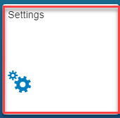
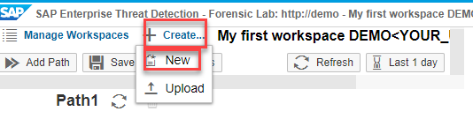
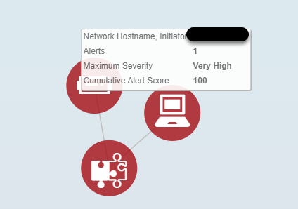
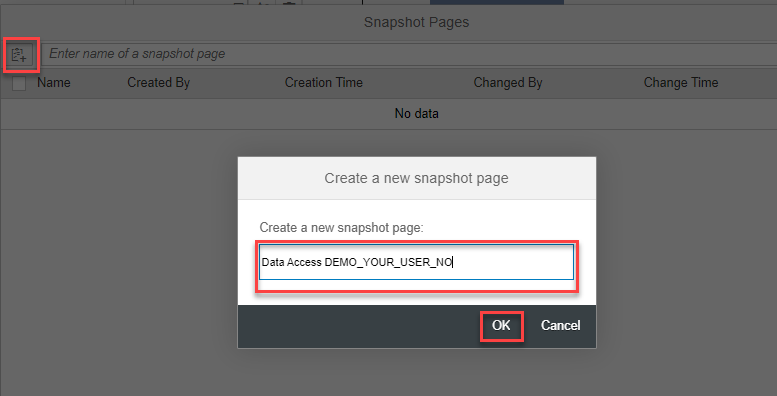

**Secure the Intelligent Enterprise with SAP Enterprise Threat
Detection**

**Exercise: Working with SAP Enterprise Threat Detection**

**Version TechEd 2023**

**Based on SAP Enterprise Threat Detection Version 2, Support Package
5**

Table of ContentS

[1. ETD User – ETD Roundtrip and Navigation
[3](#etd-user-etd-roundtrip-and-navigation)](#etd-user-etd-roundtrip-and-navigation)

[1.1. Start Page and Navigation to different tiles
[3](#start-page-and-navigation-to-different-tiles)](#start-page-and-navigation-to-different-tiles)

[1.2. Summary [22](#summary)](#summary)

[2. Security Expert - Working with the Forensic Lab
[22](#security-expert---working-with-the-forensic-lab)](#security-expert---working-with-the-forensic-lab)

[2.1. Filtering Data [23](#filtering-data)](#filtering-data)

[2.2. Modelling Charts [25](#modelling-charts)](#modelling-charts)

[2.3. Browse through the data and model your own individual charts
[28](#browse-through-the-data-and-model-your-own-individual-charts)](#browse-through-the-data-and-model-your-own-individual-charts)

[2.4. Working with Value Lists
[30](#working-with-value-lists)](#working-with-value-lists)

[2.5. Modeling Attack Detection Patterns
[31](#modeling-attack-detection-patterns)](#modeling-attack-detection-patterns)

[2.1. Summary [36](#summary-1)](#summary-1)

[3. ProcessING alerts and investigations
[36](#processing-alerts-and-investigations)](#processing-alerts-and-investigations)

[3.1. Viewing Alerts [37](#viewing-alerts)](#viewing-alerts)

[3.2. Investigating Alerts
[40](#investigating-alerts)](#investigating-alerts)

[3.3. Saving Evidence for Attacks
[49](#saving-evidence-for-attacks)](#saving-evidence-for-attacks)

[3.4. Summary [50](#summary-2)](#summary-2)

[4. Pseudonymization of User Data
[50](#pseudonymization-of-user-data)](#pseudonymization-of-user-data)

[4.1. Determining the True Identity of Users
[50](#determining-the-true-identity-of-users)](#determining-the-true-identity-of-users)

[4.2. Logging Access to User Identities
[53](#logging-access-to-user-identities)](#logging-access-to-user-identities)

[4.1. Summary [53](#summary-3)](#summary-3)

[5. Monitoring DashboardS
[53](#monitoring-dashboards)](#monitoring-dashboards)

[5.1. Viewing Default Monitoring Dashboard
[53](#viewing-default-monitoring-dashboard)](#viewing-default-monitoring-dashboard)

[5.2. Building your own Monitoring Dashboard
[55](#building-your-own-monitoring-dashboard)](#building-your-own-monitoring-dashboard)

[5.1. Summary: [57](#summary-4)](#summary-4)

<u>ETD Demo Users</u>

- Usernames: Demo01, …, Demo29: You get your User ID in the room

- Password: Welcome0

In this exercise replace **\<YOUR_USERNR\>** with your user number:

- DEMO**01** DEMO**ONE**

- DEMO**02** DEMO**TWO**

- ….

- DEMO**10** DEMO**TWENTYNINE**

Make use of the following pattern name for your own created content
(Charts, Patterns, Value-Lists, etc.) in this session:

***\<Chart name\>*** DEMO***\<YOUR_USERNR\>***

# ETD User – ETD Roundtrip and Navigation

**Tool Aspect**: In this Exercise you as an ETD User will be able to
navigate through the most important UIs of SAP Enterprise Threat
Detection. You will get knowledge about different UIs like Monitoring,
Alerts, Forensic Lab, Settings, (De-)Pseudonymization, Patterns, Value
Lists, etc.

## Start Page and Navigation to different tiles

In this Exercise you will open the start page and click on several tiles
to navigate forth and back

<table>
<colgroup>
<col style="width: 41%" />
<col style="width: 58%" />
</colgroup>
<thead>
<tr class="header">
<th>Explanation</th>
<th>Screenshot</th>
</tr>
</thead>
<tbody>
<tr class="odd">
<td><ol type="1">
<li>
After Logging on you are in the launch pad. In this exercise you
will click on each of the red marked tiles to have a 1st look
what’s in there.
</li>
</ol></td>
<td></td>
</tr>
<tr class="even">
<td><ol start="2" type="1">
<li>
Click on Tile Monitoring
</li>
</ol></td>
<td></td>
</tr>
<tr class="odd">
<td><ol start="3" type="1">
<li>
The Default Monitoring page will be shown
</li>
</ol></td>
<td></td>
</tr>
<tr class="even">
<td><ol start="4" type="1">
<li>
Click on the small tool icon in the upper right corner and select
another Monitoring page (e.g. Alert Statistics). Another Monitoring page
will be shown. In a later exercise you will learn how to create own
monitoring pages with own charts.
</li>
</ol></td>
<td></td>
</tr>
<tr class="odd">
<td><ol start="5" type="1">
<li>
Jump back to the launch pad via using upper left arrow or the
home button.
</li>
</ol></td>
<td></td>
</tr>
<tr class="even">
<td><ol start="6" type="1">
<li>
In Tile Patterns, Click on the link ‘All’ or ‘Active’.
</li>
</ol></td>
<td></td>
</tr>
<tr class="odd">
<td><ol start="7" type="1">
<li>
You see the list of the patterns, with their current state, and
how many alerts they raised.
</li>
</ol></td>
<td></td>
</tr>
<tr class="even">
<td><ol start="8" type="1">
<li>
You can jump to the details of any pattern, by clicking on the
pattern name in the list.
</li>
</ol></td>
<td></td>
</tr>
<tr class="odd">
<td><ol start="9" type="1">
<li>
When clicking on ‘Edit’, some parameter of the pattern can be
changed, e.g.:

<ol type="a">
<li>
Run frequency
</li>
<li>
Severity
</li>
<li>
Status (Active/Inactive)
</li>
<li>
Threshold
</li>
<li>
Test Mode Checkbox
</li>
</ol></li>
</ol>

You can save via using the ‘Save’ button
</td>
<td></td>
</tr>
<tr class="even">
<td><ol start="10" type="1">
<li>
When clicking on the ‘Open’ Button, the Forensic Lab opens and
you can see the modeling of the patterns, as it is delivered by SAP. The
Forensic Lab will be explained in a separate part of this exercise, and
in other exercises about modeling own use cases.
</li>
</ol></td>
<td></td>
</tr>
<tr class="odd">
<td><ol start="11" type="1">
<li>
Click the Home button to jump back to the launch pad.
</li>
</ol></td>
<td></td>
</tr>
<tr class="even">
<td><ol start="12" type="1">
<li>
Klick on Tile ‘Value Lists’
</li>
</ol></td>
<td></td>
</tr>
<tr class="odd">
<td><ol start="13" type="1">
<li>
You see the list containing all value lists. A value list can act
as a block-list or as an allow list. They are used as filter elements in
patterns, all list entries are used to filter based on these value list
entries in an inclusive or exclusive way.
</li>
</ol>
<blockquote>

Value lists can automatedly updated from outside via a rest endpoint,
if Checkbox ‘Automated’ is switched on.

Values can be added by customers (‘Add’), or SAP delivered values can
be removed (‘Remove Selected’). The changes to standard value lists are
not overwritten by updates.

</blockquote></td>
<td></td>
</tr>
<tr class="even">
<td><ol start="14" type="1">
<li>
Go back to launch pad via the left arrow
</li>
</ol></td>
<td></td>
</tr>
<tr class="odd">
<td><ol start="15" type="1">
<li>
Klick on Tile ‘Threat Situation Last Hour’.
</li>
</ol></td>
<td></td>
</tr>
<tr class="even">
<td><ol start="16" type="1">
<li>
The UI shows the correlation between Users, Systems, Patterns,
Alerts, End User Machine Hostnames. The bigger a circle, the more an
entity is involved into the correlations. E.g. in the Screenshot the
User Pseudonym HRLP_7900 is involved in 9 different Alerts, based on two
patterns.
</li>
</ol>
<blockquote>

By that it can be easily found out where there are hot spots of
Alerts, Suspicious Activities or cyber Attacks correspondingly.

By hovering over an Alert, you can as well jump to the detailed Alert
list

</blockquote></td>
<td></td>
</tr>
<tr class="odd">
<td><ol start="17" type="1">
<li>
You can toggle between the Threat Situation graphical view and
the detailed Alert list by clicking on the list button (and back from
the list)
</li>
</ol></td>
<td></td>
</tr>
<tr class="even">
<td><ol start="18" type="1">
<li>
In the alert list, you can see all single alerts with already
some alert triggering information in the column ‘Trigger’. From here you
can jump to:

<ol type="a">
<li>
The Alert itself, with more detailed descriptions.
</li>
<li>
The Pattern description, as you find it in the Tile
‘Patterns’
</li>
<li>
The triggering Events, when clicking on the Link ‘Events’ in the
‘Trigger’ Description. This is as well possible from the opened single
alert
</li>
</ol></li>
</ol></td>
<td></td>
</tr>
<tr class="odd">
<td><ol start="19" type="1">
<li>
In order to process alerts, you can mark several alerts belonging
together (i.e. having the same root cause) and start an investigation
(or add to an existing investigation).
</li>
</ol>
<blockquote>

An investigation is the evidence collection object in ETD. It will be
used for collecting all corelated alerts, screenshots, documents, single
logs, snapshots, etc., and finally provide a state and potential
resolvement. Alert and investigation handling is a separate
exercise.

</blockquote></td>
<td></td>
</tr>
<tr class="even">
<td><ol start="20" type="1">
<li>
Click on one of the Alert IDs to jump to the Alert details. From
here you can jump to:

<ol type="a">
<li>
the pattern definition
</li>
<li>
the pattern workspace in the forensic lab. The time frame then
filters automatically to the time when the alert was raised, so you can
see the log events at time of the raising of the alert. Forensic Lab
will be part of another exercise
</li>
<li>
the triggering events, so you can see the detailed normalized and
original log data that was analyzed to raise the alert. Alert handling
is part of another excercise
</li>
<li>
the related events, by filtering on the alert raising time frame,
and different available correlating attributes (e.g. user, system
,…)
</li>
</ol></li>
</ol>

Additionally you can see the Severity (Low, Medium, High, Very High)
and a Score. The Pattern related default severity can be automatedly
raised if the system is a critical system related to confidentiality,
integrity and availability. The Score multiplies the pattern criticality
(related to confidentiality, integrity and availability) with the system
criticality related to attacks against confidentiality, integrity and
availability. It can vary between 0 and 100.
</td>
<td></td>
</tr>
<tr class="odd">
<td><ol start="21" type="1">
<li>
Go back to the Alert list by clicking on the ‘back’ arrow. Then
go back to the launch pad by clicking again to the ‘back’ arrow or to
the home-button
</li>
</ol></td>
<td> </td>
</tr>
<tr class="even">
<td><ol start="22" type="1">
<li>
Click on Tile ‘Knowledge Base’.
</li>
</ol></td>
<td></td>
</tr>
<tr class="odd">
<td><ol start="23" type="1">
<li>
You can choose between 3 lists.
</li>
</ol>

The list of ‘Semantic Events’ shows all events in a human
understandable wording and with a short explanation. The semantic events
are very often translations from a technical event ID. E.g. the
technical Event AU1 from a SAP Security Audit Log is translated to User,
Logon. The semantic events are used in the forensic lab to be filtered
on. Additional semantic events can be created by customers to be used
when ingesting own log data, that needs to be normalized (learned)

The list of ‘Attributes’ shows all normalized attributes in the Event
Database table with Display Name, short description and data type. Via
each of these attributes a correlation and filtering on events is
possible within the forensic lab. Each of the attributes can be
previewed in the forensic lab with the different scatterings/value
distributions.

<strong>Information:</strong> Very often the Attributes are shown in
different roles. E.g, a user acting, and a user targeted. An acting user
can e.g. provide additional roles to a targeted user. Both users are
then part of the same log event, in their different roles.

The list of ‘Log Types’ shows all supported log types with short
names and descriptions. The log types are either the ones that are
supported out of the box or that were created there for usage in the log
learning tool, if ingesting own log data.
</td>
<td></td>
</tr>
<tr class="even">
<td><ol start="24" type="1">
<li>
Go back to the launch pad via the back arrow.
</li>
</ol></td>
<td></td>
</tr>
<tr class="odd">
<td><ol start="25" type="1">
<li>
Klick on Tile ‘System Administration’
</li>
</ol></td>
<td></td>
</tr>
<tr class="even">
<td><ol start="26" type="1">
<li>
You see a list of systems with some major attributes.
</li>
</ol></td>
<td></td>
</tr>
<tr class="odd">
<td><ol start="27" type="1">
<li>
Click on any of the lines to see the details.
</li>
</ol>

Some of the entries are filled from Meta data arriving from SAP
Application Server ABAP Systems:

<ul>
<li>
Role (e.g. Production, Test, …)
</li>
<li>
System Group
</li>
<li>
Database Host, Type, Version
</li>
<li>
Application Servers for the System Group
</li>
</ul>

Other entries can be maintained manually:

<ul>
<li>
Business Significance with regards to Confidentiality, Integrity
and Availability of the system. <strong>These attributes are multiplied
out with the corresponding pattern attributes for Confidentiality,
Integrity and Availability</strong> (see extra exercise) <strong>and
determine the raise of an Alert Severity as well as the Alert
Score!</strong>
</li>
<li>
Location
</li>
<li>
Contact Persons
</li>
<li>
Organizational information (Names, LOB, phone number, mail
address)
</li>
<li>
Status (Active/Inactive)
</li>
<li>
Landscape Information
</li>
</ul>

<strong>Information</strong>: We distinguish between System Integrity
and Data Integrity. System Integrity describes the integrity of SAP
Basis (e.g. Use cases related to manipulation of system configurations,
Security settings, debugging, etc.), Data integrity describes the
integrity of Business Data (Manipulation of Business data, spy out of
Data Privacy relevant data, etc.)

<strong>Information</strong>: The system meta data attributes can be
partly used in the forensic lab to model patterns (e.g. System Type,
System Role, System Location, System ID, System Group ID)
</td>
<td></td>
</tr>
<tr class="even">
<td><ol start="28" type="1">
<li>
Use the Home button to jump back to the launch pad
</li>
</ol></td>
<td></td>
</tr>
<tr class="odd">
<td><ol start="29" type="1">
<li>
Click on Tile ‘Forensic Lab’
</li>
</ol></td>
<td></td>
</tr>
<tr class="even">
<td><ol start="30" type="1">
<li>
In the UI you can see a filtering area on the left side and a
preview area on the right side (Pie Charts).
</li>
</ol>

In the forensic lab you can do analysis, correlation over all the log
data, semantic attributes, semantic events over shorter or longer time
frames. It can be used e.g. for User and System Behavior Analysis and
Threat Hunting. Here you can as well define own charts and patterns (as
SAP does it) and save them in a ‘Forensic Workspace’.

When starting up, it shows:

<ul>
<li>
Log data having arrived the last 15 minutes (can be changed to
any other time frame)
</li>
<li>
In the upper left pie chart: Log types having arrives in that
time frame
</li>
<li>
In the lower left pie chart: Semantic events which were contained
in the incoming log data
</li>
<li>
In the upper right pie chart: System IDs, from which data arrived
(as far as the log provides the information)
</li>
</ul>

The creation of charts, patterns, workspaces is part of additional
exercises.
</td>
<td></td>
</tr>
<tr class="odd">
<td><ol start="31" type="1">
<li>
The basic navigation in the forensic lab is described
below.
</li>
</ol>

Click on the drop down box above any of the pie charts. You see all
the ~180 semantic attributes which are available ( see Knowledge Base)
and might be filled with values. Select e.g. ‘Service, Program Name’.
Then you see in the preview all the programs (in general SAP system
executable reports) which were called within the time frame, coming out
from different logs.

Click on any of the values in the list or within a pie chart (e.g. a
certain System ID, Actor), and in the context menu, click ‘Add to Path’.
The filter path gets a new filter subset, and all information is now
filtered according to this subset.

Click on another Attribute value (e.g. a certain semantic Event and
‘Add to Path’. Then you see two filter subsets, and all data is filtered
according to these two subsets.

You can jump between the different filter subset results by clicking
on the small pie chart at each subset.

You can edit the filter conditions by clicking on the small rectangle
upper right in each subset

You can create charts and patterns, look at normalized and original
data, use the logs in a ‘Case File’ (separate exercise later), by
clicking on the number under the subset, and opening a context
menu.
</td>
<td></td>
</tr>
<tr class="even">
<td><ol start="32" type="1">
<li>
The forensic lab opens as an extra browser tab, you can close it
in the browser, and jump back to the launch pad browser tab.
</li>
</ol></td>
<td></td>
</tr>
<tr class="odd">
<td><ol start="33" type="1">
<li>
Click on Tile ‘Resolve User Identity’
</li>
</ol></td>
<td></td>
</tr>
<tr class="even">
<td><ol start="34" type="1">
<li>
In the UI you can enter a user Pseudonym, as you saw it e.g.
within Alert data, or in the forensic lab
</li>
</ol>

You can/should resolve a pseudonym, especially if a suspicious
activity was finally determined or acknowledged by the security
analyst.

If there is the need to do e.g. an ad’hoc analysis for a user, a
reverse resolution (UserID Pseudonym) can be done, and then even a jump
to the forensic lab can be done from within the reverse resolution,
prefiltered to the different roles (Acting, Targeted, …) of the user
id.

Information: A special Authorization/Role is needed to do the
resolution. A 4-eyes principle or special resolution policy can hence be
established.

(De-) Pseudonymization is part of another exercise.
</td>
<td></td>
</tr>
<tr class="odd">
<td><ol start="35" type="1">
<li>
Jump back to launch pad by using the home button.
</li>
</ol></td>
<td></td>
</tr>
<tr class="even">
<td><ol start="36" type="1">
<li>
Click on Tile ‘Security Notes’
</li>
</ol></td>
<td></td>
</tr>
<tr class="odd">
<td><ol start="37" type="1">
<li>
If the corresponding meta data transfer is set up in the Source
SAP Application Server ABAP Systems, the UI provides an overview about
available and relevant security notes and the patch state of the systems
related to these notes.
</li>
</ol>

It shows if a note is relevant for a certain system (or not), By
Clicking on e.g. the CVSS Base Score Column, a sorting is possible, and
an overview can be provided related to the most important Security
notes. The filtering allows as well to find out if e.g. a certain note
is relevant for a certain system, etc.

This functionality as such can be as well provided by other tools
from SAP and partners, it is just a precondition for the ‘Patch Risk
Score’ shown in ‘System Monitoring’, together with a ‘Business Attack
Score’ and a ‘Business Risk Score’.
</td>
<td></td>
</tr>
<tr class="even">
<td><ol start="38" type="1">
<li>
Jump back to launch pad by using the home button.
</li>
</ol></td>
<td></td>
</tr>
<tr class="odd">
<td><ol start="39" type="1">
<li>
Click on Tile ‘System Monitoring’.
</li>
</ol></td>
<td></td>
</tr>
<tr class="even">
<td><ol start="40" type="1">
<li>
The UI shows per different system roles (Production, Test, …) the
different scores:
</li>
</ol>
<ul>
<li>
Business Risk Score: System criticality as to the maintained
criticality in ‘System Administration’ about Confidentiality, Integrity
and Availability. It can be changed by changing/maintaining the values
in ‘System Administration’.
</li>
<li>
Business Attack Score: Aggregated Alert Score from Alerts related
to the system landscape, or to single systems, or to single systems and
clients. If there exist non-processed Alerts related to the system, with
a high Alert score, then the Business Attack Score is high.
</li>
<li>
Patch Risk Score: Based on the Patch State (See Tile ‘Security
Notes’), the criticality of the system and the criticality of relevant
notes which are not patched, a Patch Risk Score is calculated.
</li>
</ul>

In the 1st UI the Scores are shown in an aggregated way,
drill down is possible. The next level shows the same scores for a whole
system. The next drilldown level shows the Scores for a system and its
correlated clients. The next drilldown shows the detailed information,
why the scores are high low:

<ul>
<li>
List of top 20 open Alerts
</li>
<li>
List of top 20 missing security patches
</li>
</ul>

Navigation into each Alert is possible from there.
</td>
<td>

Aggregated Landscape View

Aggregated System ID View

Aggregated System/Client View

Detailed View for one System or System and client
</td>
</tr>
<tr class="odd">
<td><ol start="41" type="1">
<li>
Jump back to launch pad by using the home button.
</li>
</ol></td>
<td></td>
</tr>
<tr class="even">
<td><ol start="42" type="1">
<li>
Click on Tile ‘Record of Actions’
</li>
</ol></td>
<td></td>
</tr>
<tr class="odd">
<td><ol start="43" type="1">
<li>
In the UI you can see all actions either done automatically or by
Users using ETD.
</li>
</ol>

In the example a filtering took place about actions that happened
last day and that were triggered by user DEMO01. User DEMO01 resolved a
user pseudonym TMHY_28081 and looked up the user pseudonym for user
DEMO01.

In the filter it can be selected via very different Entity Types
about what happened in the ETD system.

The functionality is built in for compliance reasons, to get exact
information about who did what and to be able to find out this was
compliant/incompliant.

Information: The Record of Action Log is additionally used for ETD
self-monitoring. Patterns/Use cases that throw alerts are available,
e.g. in the case of critical changed to a pattern (e.g. deactivate
it)
</td>
<td></td>
</tr>
<tr class="even">
<td><ol start="44" type="1">
<li>
Jump back to launch pad by using the home button.
</li>
</ol></td>
<td></td>
</tr>
<tr class="odd">
<td><ol start="45" type="1">
<li>
Click on Tile ‘Settings’
</li>
</ol></td>
<td></td>
</tr>
<tr class="even">
<td><ol start="46" type="1">
<li>
In the UI you can see the different possibilities for ETD
configuration.
</li>
</ol>
<ul>
<li>
Manage Storage: Here you can define the retention periods for Hot
Storage and Warm Storage. Information: To determine these values, SAP
provides a sizing guide.
</li>
<li>
Manage Alert Publishing: Here you can define an Alert
Forwarding/Pushing from ETD to any Rest Endpoint. You can define the
base URL to send to (credentials are created within the HANA platform),
the Alert format, a filter maintained in Menu item ‘Pattern Filter’,
whether the triggering events shall be added to the alert, and whether
the Alert status shall be set to ‘Forwarded’. Additionally, you can
define mail receivers to send the alerts via mail.
</li>
<li>
Pattern Filter: Here you can define different filters you can use
either to push out only certain alerts, or to hand over the filter ID
via the Alert retrieval API to get only the alerts related to the
patterns within the filter
</li>
<li>
Content Replication: If you use a 2-tier ETD landscape (one
pre-prod for Pattern creation and testing, one prod for running the
patterns and processing alerts. Then the objects (like Workspaces,
patterns, value lists, as well as e.g. maintained system meta data) can
be transported from the pre-prod system to the prod system. In this UI
you can define the transport directions for this data. The configuration
of the transport directions are done in a configuration file (described
in the SAP help documentation)
</li>
<li>
Time Zone: Here you can define whether the ETD users work always
in UTC timezone (makes sense if the ressourcces are distributed over the
world. So that they can easily discuss critical topics and speak about
the same time) or in local time zone (easier in case everyone works in
the same time zone)
</li>
<li>
Anomaly Detection: You can define whether you want to collect
data as well for currently inactive anomaly detection patterns. Reason:
If you set such a Pattern active at a later point in time´, it can
directly create alerts, instead of needing to start now collecting data
over e.g. 12 weeks with some waiting time if the 12 weeks more than the
retention time.
</li>
<li>
Custom Values: You can create own custom values for
investigations and workspaces. In the example screenshot further
investigation values are created to define a kind of a current
processing state by different security analyst levels
</li>
<li>
Workload Management: If queries start to be to memory exhausting,
the HANA DB slows down for other users to fulfill the current request
with all resources needed. In order to allow other to work, during such
a ‘heavy’ query is running, the workload management restricts the
resources to a maximum threshold for executing one query.
</li>
<li>
Pseudonymization: can be switched on and off, depending on the
Country specific, industry specific, company specific
regulations.
</li>
</ul></td>
<td>

Retention Times

Alert forwarding

Pattern Filter

Custom Values
</td>
</tr>
<tr class="odd">
<td><ol start="47" type="1">
<li>
Jump back to launch pad by using the home button.
</li>
</ol></td>
<td></td>
</tr>
</tbody>
</table>

## Summary

**Tool Aspect:** You learned how to navigate within SAP Enterprise
Threat Detection, and by that you went through the most relevant UIs and
functionalities, allowing you to understand, what it is made for, and
how things are correlated (e.g., information from knowledge base, and
what you see in alerts and in the forensic lab). Some of the tools are
further explored in detail in the following exercises.

# Security Expert - Working with the Forensic Lab 

**Security Aspect**: The Security Expert sometimes needs to do an ad-hoc
analysis about things that happen in the landscape, or he gets a hint
about certain suspicious behavior of an IP Address, within an SAP
System, of certain program calls etc.

He might need to create own charts to easier interpret the data and the
suspicious behavior within, and even he might need to create an own
detection patterns to get future alerts about the suspicious actions he
found during his analysis.

**Tool Aspect:** The forensic lab is one the most important application
in SAP Enterprise Threat Detection and helps you to gain insight about
what is going on at present in your system landscape.

Forensic lab supports workspaces for identifying and analyzing
weaknesses or attacks and supports the modelling of charts or attack
detection patterns. For attack detection patterns, you create the
configurations, which you want SAP Enterprise Threat Detection to use to
scan for events that match the pattern. No coding or complex regex/SQL
queries are needed, instead SAP Enterprise Threat Detection takes care
of transforming your attack detection pattern model to SAP HANA
optimized queries.

In this exercise you will learn how to work with the forensic lab, how
to analyze log events and how to create charts and attack detection
patterns.

## Filtering Data

In this exercise, you will display failed log on attempts, and you will
learn how filters can be created.

<table>
<colgroup>
<col style="width: 41%" />
<col style="width: 58%" />
</colgroup>
<thead>
<tr class="header">
<th>Explanation</th>
<th>Screenshot</th>
</tr>
</thead>
<tbody>
<tr class="odd">
<td><ol start="48" type="1">
<li>
Open tile <strong>Forensic Lab</strong> in the SAP Enterprise
Threat Detection Launchpad.
</li>
</ol></td>
<td></td>
</tr>
<tr class="even">
<td rowspan="2"><ol start="49" type="1">
<li>
The initial screen of the forensic lab shows the log events from
last 15 minutes. The left part of the workspace contains the filter
paths. The right part of the workspace is used to display the log
events. They are called browsing charts. You can e.g. see which log
types – <em>Event, Log Type</em> - are received, from which systems -
<em>System ID, Actor</em> - or which actions - <em>Event (Semantic)</em>
- have been performed. Change the drop-down value in one of the browsing
charts to see information about other semantic attributes.
</li>
</ol></td>
<td rowspan="2"></td>
</tr>
<tr class="odd">
</tr>
<tr class="even">
<td><ol start="50" type="1">
<li>
Push button <em>Change time period.</em>
</li>
</ol>
<blockquote>

Change time period selection to <em><strong>1 hour</strong></em> and
push button <em>OK</em> to analyze the log events from last day.

Look at the path and the browsing charts that have been updated.

</blockquote></td>
<td></td>
</tr>
<tr class="odd">
<td><ol start="51" type="1">
<li>
To add a filter for failed logon events, click on legend <em>User
Logon, Failure.</em>

<strong>Hint:</strong> If there are no <em>User Logon, Failure</em> Events, please log out of ETD, and try to logon by explicitly using a wrong password for one time. Then a <em>User Logon, Failure</em> Event arrives. After that you can logon with the right password again
</li>
</ol></td>
<td></td>
</tr>
<tr class="even">
<td><ol start="52" type="1">
<li>
Select menu item <em>Add to Path.</em> This will create a filter
for failed logons that have been occurred in the last day. It is shown
as <em>Subset</em> in the filter path.
</li>
</ol></td>
<td></td>
</tr>
<tr class="odd">
<td><ol start="53" type="1">
<li>
Look at <em>Path1</em> and see the subset that has been added.
Observe that the browsing charts have been updated as well.
</li>
</ol></td>
<td></td>
</tr>
</tbody>
</table>

## 

## 

## Modelling Charts

Based on the subset you have created in the filter path, you can further
filter the log events, or you can create charts to see more details. In
this exercise you will create a chart of failed logon events including
information about systems and users.

<table>
<colgroup>
<col style="width: 41%" />
<col style="width: 58%" />
</colgroup>
<thead>
<tr class="header">
<th>Explanation</th>
<th>Screenshot</th>
</tr>
</thead>
<tbody>
<tr class="odd">
<td><ol start="54" type="1">
<li>
Push button  right to the subset number.
This opens a drop-down menu with all available operations you can
perform on the subset. Select menu item <em>Create Chart</em>
</li>
</ol></td>
<td></td>
</tr>
<tr class="even">
<td><ol start="55" type="1">
<li>
Show the Chart:
</li>
</ol>

Click on the Chart Icon lower left. The Chart opens on the right part
of the UI
</td>
<td></td>
</tr>
<tr class="odd">
<td rowspan="2"><ol start="56" type="1">
<li>
Change the chart name:
</li>
</ol>
<blockquote>

<em>Click on the pencil symbol</em>

<em>In the Popup enter:</em>

<em>Failed Logon DEMO<strong>&lt;YOUR_USERNR&gt;</strong></em>

Press o.k.

</blockquote></td>
<td rowspan="2">

</td>
</tr>
<tr class="even">
</tr>
<tr class="odd">
<td><ol start="57" type="1">
<li>
Push button . Add the following
description and push button <em>OK.</em>
</li>
</ol>
<blockquote>

Description:

<em>Failed Logon Events by Systems and Users</em>

</blockquote></td>
<td></td>
</tr>
<tr class="even">
<td><ol start="58" type="1">
<li>
Click on link <em>Append group by field</em> and add field
<em>System ID, Actor.</em> The chart will be updated with the system
information on which failed logon attempts have been observed.
</li>
</ol></td>
<td></td>
</tr>
<tr class="odd">
<td><ol start="59" type="1">
<li>
Click on link <em>Append group by field</em> and add field
<em>System Role, Actor.</em> The chart will be updated with additional
system role information.
</li>
</ol></td>
<td></td>
</tr>
<tr class="even">
<td><ol start="60" type="1">
<li>
Click on link <em>Append group by field</em> and add field
<em>User Account Name Pseudonym, Target.</em> The chart will be updated
with additional user information.
</li>
</ol></td>
<td></td>
</tr>
<tr class="odd">
<td><ol start="61" type="1">
<li>
You can now save your changes.
</li>
</ol>
<blockquote>

On the left lower area enable checkbox <em>Shared</em>. This allows
other users to access your charts.

Push button <em>Save</em>.

</blockquote></td>
<td></td>
</tr>
<tr class="even">
<td><ol start="62" type="1">
<li>
Provide name and namespace for your workspace and push button
<em>OK.</em>
</li>
</ol>
<blockquote>

Name:

<em>My first workspace
DEMO<strong>&lt;YOUR_USERNR&gt;</strong></em>

Namespace:

<em>http://demo</em>

</blockquote></td>
<td></td>
</tr>
</tbody>
</table>

## Browse through the data and model your own individual charts

In your newly created workspace, *my first workspace
DEMO\<YOUR_USERNR\>* you can add a new path by pushing the button
.
On the new path you can create new filters by adding new subsets either
via the browsing charts or by clicking on the link
.
AND operator

between subsets can be toggled to an OR operator
.

Also have a close look on the *Subset Selection* options (Example):

You can filter specific fields (= *Field*) from semantic attributes
using a specific operator (=*Operators)* and providing corresponding
filter values (= *Value*)

You can use the option *Reference* to correlate Events from one path to
another path

You can use Value-List containing pre-defined values for filtering the
data

Make use of the following chart name for your own created charts:

**\<Chart name\>** *DEMO**\<YOUR_USERNR\>***

Save your changes. To retrieve the Workspace when opening a new Forensic
Lab UI, click on *‘Manage Workspaces’* and select your own one.

## Working with Value Lists

Value List allows to simplify the filtering of events. Instead of adding
multiple values manually into the Subset Filter multiple times, you can
filter the data for multiple values more easily by using a value-list.

Patterns delivered by SAP Enterprise Threat Detection makes as well use
of value-lists. To tune the patterns in the way that the use case fits
to the customers environment, the value lists can be adjusted and
enhanced accordingly.

Open a new SAP ETD Launchpad tab in your browser and have a closer look
on tile *Value Lists:*

In the *Value List* application, you can view existing ones that are
delivered with SAP Enterprise Threat Detection

The value lists delivered with SAP Enterprise Threat Detection have
pre-defined values, that can be adjusted and enhanced

You can also create your own value lists

## Modeling Attack Detection Patterns

The forensic lab supports the creation of attack detection patterns. The
procedure is similar to the procedure of creating charts. Attack
detection patterns are as well based on a particular subset of log
events. Now you will create a pattern that will deliver an alert when
SAP Standard users execute critical function modules in critical
systems.

<table>
<colgroup>
<col style="width: 41%" />
<col style="width: 58%" />
</colgroup>
<thead>
<tr class="header">
<th>Explanation</th>
<th>Screenshot</th>
</tr>
</thead>
<tbody>
<tr class="odd">
<td><ol start="63" type="1">
<li>
Push button <em>Create</em> and then ‘New’ to create a new
workspace.
</li>
</ol></td>
<td></td>
</tr>
<tr class="even">
<td><ol start="64" type="1">
<li>
In the Chart for ‘Event (Semantic) Search for Event
<em>Executable, RFC enabled Function Module, Run</em>, and by clicking
on the Event, select <em>Add to Path</em>.
</li>
</ol>
<blockquote>

As result, your filter path now has a filter on this event

</blockquote></td>
<td>

</td>
</tr>
<tr class="odd">
<td><ol start="65" type="1">
<li>
By clicking <em>Add new subset</em> in the path, you can add
value lists to the path.
</li>
</ol>
<blockquote>

To filter on the value list with critical function modules
(pre-delivered by SAP), in the popup select:

</blockquote>
<ul>
<li>
Field: <em>Service, Function Name</em>
</li>
<li>
Operator: <em>IN VALUE LIST</em>
</li>
<li>
Value: <em>ABAPBlocklistedFunctionModules</em>
</li>
</ul>
<blockquote>

Then press <em>OK</em>

<em>As a result, another subset was added to the filter
path.</em>

</blockquote></td>
<td>

</td>
</tr>
<tr class="even">
<td><ol start="66" type="1">
<li>
Now, additionally add the following filter paths, as shown above,
to further select on critical systems, and on SAP Standard
Users:
</li>
</ol>
<blockquote>

Subset 3:

Field: <em>System ID, Actor</em>

Operator: <em>IN VALUE LIST</em>

Value: <em>DemoCriticalSystems</em>

Subset 4:

Field: <em>User Account Name Pseudonym, Actor</em>

Operator: <em>IN VALUE LIST</em>

Value: <em>SAPStandardUsers</em>

As a result, subsets 3 and 4 should have been added to the filter
path.

</blockquote></td>
<td></td>
</tr>
<tr class="odd">
<td><ol start="67" type="1">
<li>
Save the Workspace
</li>
</ol></td>
<td></td>
</tr>
<tr class="even">
<td><ol start="68" type="1">
<li>
Now create a Pattern that creates an Alert if the filter in
subset 4 is not zero.
</li>
</ol>
<blockquote>

Click on the small triangle within subset 4 and then in the popup
click on <em>Create Pattern</em>

</blockquote></td>
<td></td>
</tr>
<tr class="odd">
<td><ol start="69" type="1">
<li>
On the right side of the screen you can now model the
Pattern:
</li>
</ol>
<blockquote>

Name: <em>CriticalFunctionModuleCalls&lt;DEMO_UserNO&gt;</em>

Timeframe: <em>Last 30 Minutes</em>

Status: <em>Active</em>

Execution Output: <em>Alert</em>

</blockquote></td>
<td></td>
</tr>
<tr class="even">
<td><ol start="70" type="1">
<li>
To show data in the future Alerts, field grouping is needed.
Exactly the grouped fields are each per grouping raising an Alert and
exactly the grouped fields are shown in the upcoming Alerts.
</li>
</ol>
<blockquote>

Press <em>Append group by field</em> and select the following fields
to be grouped on:

</blockquote>
<ul>
<li>
<em>System ID, Actor</em>
</li>
<li>
<em>Service, Function Name</em>
</li>
<li>
<em>User Account Name Pseudonym, Actor</em>
</li>
</ul></td>
<td>

</td>
</tr>
<tr class="odd">
<td><ol start="71" type="1">
<li>
Do further settings within the Pattern:
</li>
</ol>
<blockquote>

Execution: <em>Scheduled</em>

Runs Every (min): <em>2</em>

Alert Severity: <em>High</em>

Credibility of the Attack:

Confidentiality: <em>Proven</em>

System Integrity: <em>Suspected</em>

Data Integrity: <em>Suspected</em>

Success of Attack

Confidentiality: <em>Successful</em>

System Integrity: <em>Undetermined</em>

Data Integrity: <em>Undetermined</em>

<strong>Important</strong>: Set the Pattern to value
<em><strong>Shared</strong></em>

<strong>Finally Save again</strong>

<strong>Notes</strong>: the scheduled execution of each 2 minutes is
for demo purposes only, so that alerts are raised when waiting. The
scheduled execution times to select are dependent on:

</blockquote>
<ul>
<li>
Criticality of the Alert. The more critical the smaller the
execution intervals
</li>
<li>
Numbers of aggregated log events to be considered in a certain
time interval, to raise the Alert, if the threshold is bigger than one.
<strong>Example</strong>: More than 3 failed logons per user and system
within a timeframe of 5 Minutes or 30 Minutes or 2 hours or one week are
considered to be alerted?
</li>
<li>
The Time frame selected for the whole workspace.
<strong>Example</strong>: A selected time frame of last week aggregates
the data of one week, but an execution of the pattern each 2 minutes
might sometimes still make sense, but very often the selected values do
not fit. Mostly the time frames of workspace time interval and
Pattern-execution time interval should be similar, with some overlap. A
typical value would be the execution of a Pattern each 10 minutes and
the time interval of a Workspace of last 15 minutes.
</li>
</ul></td>
<td>

</td>
</tr>
<tr class="even">
<td><ol start="72" type="1">
<li>
Check corresponding Alerts in he Alerts-Tile in the starting Page
of ETD. After while (if the Filter Path in the workspace shows numbers
bigger than zero).
</li>
</ol>
<blockquote>

Find the Alerts for your Pattern in the Alert list and see the detail
information that corresponds to the grouping in the modeled Pattern.

Click on the Alert ID and see the details within the Alert.

<strong>Note</strong>: Alert and Investigation handling will be
handled in a later chapter

</blockquote></td>
<td>

</td>
</tr>
</tbody>
</table>

## Summary

**Security Aspect:** As a Security Expert you are now able to do
forensic analysis and find suspicious behaviors and evidences in big
amounts of data. Now you can visualize this data as to your needs and
create own Attack Detection Patterns in case you need to get Alerts on
future occurrences of this situation.

**Tool Aspect:** You learned how to use the Forensic Lab to look into
data, create Charts and Patterns and how to save them and to make them
available to others.

**Note**: The example pattern you modelled is already part of the
standard content delivery of ETD

# ProcessING alerts and investigations

**Security Aspect:** As a Security Analyst in Level 1, 2 or 3 one of
your main tasks is to check for raised Alerts and to process them. You
need to answer questions like

- Was this a real Alert or a false positive?

- What are evidences which need to be collected to proof the attack or
  misuse?

- Are there additional Alerts related to this Alert?

Then you may need to collect the evidences and to follow a Standard
Operation Procedure for the further actions.

**Tool Aspect:** SAP Enterprise Threat Detection raises alerts as
notification for potential attacks as they are happening. An alert
includes references to the log events and the attack detection patterns
or the anomaly detection patterns that led to its creation. Alerts are
processed and analyzed by making use of various applications provided by
SAP Enterprise Threat Detection. After your analysis of an alert, you
can mark it as an attack, or a suspected attack and you can add it to an
investigation. Investigations are collections of related material such
as alerts, related events, case files, and snapshots. They are the
central item with which more than one person might work with (e.g.
monitoring agents and/or security experts).

## Viewing Alerts

As the monitoring agent of a company, you need to monitor the alerts and
react immediately. In the case of a suspected attack, it is usually the
user or the hostname behind it or the system affected that you need to
identify.

In this exercise you will learn how alerts are viewed and how an
investigation is started in case of a suspected attack.

<table>
<colgroup>
<col style="width: 42%" />
<col style="width: 57%" />
</colgroup>
<thead>
<tr class="header">
<th>Explanation</th>
<th>Screenshot</th>
</tr>
</thead>
<tbody>
<tr class="odd">
<td><ol start="73" type="1">
<li>
Open tile <em>Open Alerts – Very High Last Day,</em> or as well
click on the <em>Alerts</em> Tile, if no severity ‘very high’ alerts are
available<em>.</em>
</li>
</ol></td>
<td></td>
</tr>
<tr class="even">
<td rowspan="2"><ol start="74" type="1">
<li>
Open Filter Bar. Add the pattern you have created until step 71
as filter and push button <em>GO.</em>
</li>
</ol>
<blockquote>

<em>CriticalFunctionModuleCalls&lt;DEMO_UserNO&gt;</em>

<em>Comment:</em>

<em>This is only needed for this exercise due to having multiple
users working on the same exercise. In generals the Alerts List User
Interface is used as a worklist for alerts by the monitoring
agent.</em>

</blockquote></td>
<td rowspan="2"></td>
</tr>
<tr class="odd">
</tr>
<tr class="even">
<td><ol start="75" type="1">
<li>
Look at the alert that has been raised.
</li>
</ol>
<blockquote>

The severity of the alert provides the firsts indication how to
prioritize the worklist of a monitoring agent.

Under column ‘Trigger’ you can see the system on which a critical
function module was executed.

</blockquote></td>
<td></td>
</tr>
<tr class="odd">
<td><ol start="76" type="1">
<li>
Push button <em>View Threat Situation</em> and see e.g. the
<em>Network Hostname Initiator</em> that has been used for downloading
data.
</li>
</ol></td>
<td>

</td>
</tr>
<tr class="even">
<td><ol start="77" type="1">
<li>
Switch back to the <em>Alerts List View</em> and click on alert
<em>ID</em> to see more details about the alerts
</li>
</ol></td>
<td></td>
</tr>
<tr class="odd">
<td><ol start="78" type="1">
<li>
Look at the header Information of the alerts. It shows basic data
about the alert such as the pattern it was created by or by which
metrics the alert has been triggered. Use the links to see the details
of the alert.
</li>
</ol></td>
<td></td>
</tr>
<tr class="even">
<td><ol start="79" type="1">
<li>
Click on the <em>Triggering Events</em> to see more
details.
</li>
</ol></td>
<td></td>
</tr>
<tr class="odd">
<td><ol start="80" type="1">
<li>
See the details of the events that has led to the alert creation
e.g. the system where a suspicious activity has been detected or the
transaction in which the download was executed.
</li>
</ol></td>
<td></td>
</tr>
<tr class="even">
<td><ol start="81" type="1">
<li>
Click on button <em>Back</em> to return to the alert details
view.
</li>
</ol></td>
<td></td>
</tr>
<tr class="odd">
<td><ol start="82" type="1">
<li>
Click on <em>System ID</em> to see the details of the affected
system.
</li>
</ol></td>
<td></td>
</tr>
<tr class="even">
<td><ol start="83" type="1">
<li>
Look at the details of the affected system.
</li>
</ol></td>
<td></td>
</tr>
<tr class="odd">
<td><ol start="84" type="1">
<li>
Under tab <em>Connected Systems</em> you can see that the
affected system has done a remote communication.
</li>
</ol></td>
<td></td>
</tr>
<tr class="even">
<td><ol start="85" type="1">
<li>
Open a new browser tab and open SAP Enterprise Threat Detect
Launchpad. Open tile <em>Systems</em> to see the details of the system
to which a remote communication has taken place.
</li>
</ol></td>
<td></td>
</tr>
<tr class="odd">
<td><ol start="86" type="1">
<li>
Enter the System ID in the search field an select the system to
see the details. <em>(Hint: if there are too many systems in the ETD
system, the filter only works for the shown Systems in the list. In case
the system S4H/100 is not found, please page down until it is
shown)</em>
</li>
</ol></td>
<td></td>
</tr>
</tbody>
</table>

## 

## Investigating Alerts

Investigations are collections of related material such as alerts, case
files, and snapshots. They are the central item with which the
monitoring agents and/or the security expert starts his forensic
research, as they can lead to an incident.

When the monitoring agent considers an alert suspicious, an
investigation gets started. The investigation gets a description, a
severity, a status and comments can be added. The investigation can be
shared easily, either in emails or as tiles in the launchpad, or even as
a PDF file. More alerts and other related material can be added later,
and the status can be changed in order to make tracking of the
investigation easy. It is also possible to create a CSV file with a list
of all triggering or related events of the alerts in the investigation.

As the investigation is an item that more than one person might work
with, there is a discussion and timeline tab in which manual comments as
well as changes to the investigation are tracked.

<table>
<colgroup>
<col style="width: 41%" />
<col style="width: 58%" />
</colgroup>
<thead>
<tr class="header">
<th>Explanation</th>
<th>Screenshot</th>
</tr>
</thead>
<tbody>
<tr class="odd">
<td><ol start="87" type="1">
<li>
In the Alerts worklist view, select the alert and push button
<em>Start Investigation.</em> Choose <em>Start From Template</em> 
<em>Information Disclosure</em>
</li>
</ol>
<blockquote>

<strong><mark><u>INFORMATION:</u></mark></strong>

The Investigation Popup should be prefilled from the template, but as
to a software bug, this automated filling does not happen.

By that please fill in:

</blockquote>
<ul>
<li>
Description: Download sensitive information
</li>
<li>
Severity: Very High
</li>
<li>
Status: In Process
</li>
<li>
Attack: Suspected
</li>
<li>
Management Visibility: Level 1 Security Operations
</li>
<li>
Comment: &lt;Any comment you want&gt;
</li>
</ul></td>
<td></td>
</tr>
<tr class="even">
<td><ol start="88" type="1">
<li>
Set yourself as processor of the investigation, set the Status to
In Process and check the instructions how to handle this type of alert.
Push button <em>Add and Show Investigation.</em>
</li>
</ol></td>
<td></td>
</tr>
<tr class="odd">
<td><ol start="89" type="1">
<li>
Click on tab <em>Alerts</em> and click on alert <em>ID</em> to
further investigate details of the alert.
</li>
</ol></td>
<td></td>
</tr>
<tr class="even">
<td><ol start="90" type="1">
<li>
Click on related events to gain more insight about the potential
threat.
</li>
</ol></td>
<td></td>
</tr>
<tr class="odd">
<td><ol start="91" type="1">
<li>
Select the event row to see more details. Add to your
investigation if relevant.
</li>
</ol></td>
<td></td>
</tr>
<tr class="even">
<td><ol start="92" type="1">
<li>
Update Investigations with your current investigation analysis
results. E.g. use the tab discussions and add comments or screenshots to
affected system details, size of downloaded data, hostname or user
information. Screenshots can be added via Drag &amp; Drop. <em>(In the
picture on the right you see a screenshot which is pasted into the
comment field)</em>
</li>
</ol></td>
<td></td>
</tr>
<tr class="odd">
<td><ol start="93" type="1">
<li>
Make use of Alert Clusters to visualize alerts based on the
users, hostnames, systems or patterns involved. Open a new browser tab
and start SAP Enterprise Threat Detection Launchpad. Open tile
<em>Fields of Attention – Alert Clusters.</em>
</li>
</ol></td>
<td></td>
</tr>
<tr class="even">
<td><ol start="94" type="1">
<li>
Choose button <em>Settings.</em>
</li>
</ol></td>
<td></td>
</tr>
<tr class="odd">
<td><ol start="95" type="1">
<li>
Change Graph Settings as follows:
</li>
</ol>
<blockquote>

Time range: 
<em>1 Hour</em>

Focus of attention: 
<em>Hostname</em>

Entity of attention:

<em>System ID. Actor</em>

<em>System ID, Target</em>

<em>Account Name Pseudonym, Acting</em>

<em>Account Name Pseudonym, Targeted</em>

Push button <em>OK.</em>

</blockquote></td>
<td></td>
</tr>
<tr class="even">
<td><ol start="96" type="1">
<li>
Push button <em>Filter</em> and only enable the hostname that has
triggered the alerts.
</li>
</ol></td>
<td></td>
</tr>
<tr class="odd">
<td><ol start="97" type="1">
<li>
Look at the alert graph focusing on the selected hostname and see
how it is connected to patterns, alerts and systems. Click on the
hostname node to see further details.
</li>
</ol></td>
<td></td>
</tr>
<tr class="even">
<td><ol start="98" type="1">
<li>
Look at the alerts and events shown on the timeline where this
hostname was involved.
</li>
</ol></td>
<td></td>
</tr>
<tr class="odd">
<td><ol start="99" type="1">
<li>
You can slide and/or stretch the view to better visualize the
events on the timeline. Start your analysis from left to right to get an
understanding what has been done by the given hostname until the alerts
have been raised.
</li>
</ol></td>
<td></td>
</tr>
<tr class="even">
<td><ol start="100" type="1">
<li>
Click on the circle to see the event details.
</li>
</ol></td>
<td></td>
</tr>
<tr class="odd">
<td><ol start="101" type="1">
<li>
Push button <em>Add to Case File</em>  to
add all relevant events that are related to the alert creation.
</li>
</ol></td>
<td></td>
</tr>
<tr class="even">
<td><ol start="102" type="1">
<li>
Save your case file by pushing the button Save. Provide name and
namespace as follows and push button <em>OK.</em>
</li>
</ol>
<blockquote>

Name:

Download path <em>DEMO&lt;YOUR_USERNR&gt;</em>

Namespace:

<a href="http://demo"><em>http://demo</em></a>

</blockquote></td>
<td></td>
</tr>
<tr class="odd">
<td><ol start="103" type="1">
<li>
Push button <em>Add to Investigation.</em>
</li>
</ol></td>
<td></td>
</tr>
<tr class="even">
<td><ol start="104" type="1">
<li>
Select your investigation and push button <em>Add and Show
Investigation.</em>
</li>
</ol></td>
<td></td>
</tr>
<tr class="odd">
<td><ol start="105" type="1">
<li>
Update the investigation Discussion with your analysis
results.
</li>
</ol></td>
<td></td>
</tr>
<tr class="even">
<td><ol start="106" type="1">
<li>
Open forensic lab and change time range to last 2 hours. Analyze
the log events and see if you can find further events related to the
remote system and the SAP Standard user that has been mis-used.
</li>
</ol></td>
<td></td>
</tr>
<tr class="odd">
<td><ol start="107" type="1">
<li>
Create the following filters:
</li>
</ol>
<blockquote>

System ID, Actor = <em>S4H/100</em>

User Account Name Pseudonym, Acting = <em>SAP*</em>

</blockquote></td>
<td></td>
</tr>
<tr class="even">
<td><ol start="108" type="1">
<li>
Look at the browsing chart for <em>Event (Semantic)</em> and see
the event <em>Data, Monitored Data, Access.</em>
</li>
</ol></td>
<td></td>
</tr>
<tr class="odd">
<td><ol start="109" type="1">
<li>
Add a filter for this event.
</li>
</ol></td>
<td></td>
</tr>
<tr class="even">
<td><ol start="110" type="1">
<li>
Create a chart with the following <em>Group By</em>
fields:
</li>
</ol>
<blockquote>

<em>Event (Semantic)</em>

<em>System ID, Actor</em>

<em>User Account Pseudonym, Actor</em>

<em>Service, Function Name</em>

<em>Parameter Value, String</em>

<em>Generic, Outcome</em>

</blockquote></td>
<td></td>
</tr>
<tr class="odd">
<td><ol start="111" type="1">
<li>
Provide the following chart name.
</li>
</ol>
<blockquote>

Chart name:

<em>Data Access DEMO&lt;YOUR_USERNR&gt;</em>

Enable checkbox <em>Shared</em> and push button <em>Save</em>.
Provide the following workspace name.

Name:

<em>Unsuccessful Data Access DEMO&lt;YOUR_USERNR&gt;</em>

Namespace:

<em>http://demo</em>

</blockquote></td>
<td></td>
</tr>
<tr class="even">
<td><ol start="112" type="1">
<li>
Push button <em>Add chart to snapshot page.</em>
</li>
</ol></td>
<td></td>
</tr>
<tr class="odd">
<td><ol start="113" type="1">
<li>
Push button <em>Create a new snapshot page.</em> Provide the
following snapshot page name and push button <em>Add and
Show.</em>
</li>
</ol>
<blockquote>

Snapshot page name:

<em>Data Access DEMO&lt;YOUR_USERNR&gt;</em>

</blockquote></td>
<td>

</td>
</tr>
<tr class="even">
<td><ol start="114" type="1">
<li>
Push button <em>Add snapshot page to investigation.</em>
</li>
</ol></td>
<td></td>
</tr>
<tr class="odd">
<td><ol start="115" type="1">
<li>
Select your investigation and push button <em>Add and Show
Investigation.</em>
</li>
</ol></td>
<td></td>
</tr>
<tr class="even">
<td><ol start="116" type="1">
<li>
You find the Snapshot in the <em>Objects-</em>Tab of the
Investigation
</li>
</ol>
<blockquote>

Edit and update the investigation with your findings and close
it.

</blockquote></td>
<td></td>
</tr>
</tbody>
</table>

## Saving Evidence for Attacks

## 

Print an investigation or save it to a PDF file. Such a PDF file can,
for example, be used to attach an investigation to an external ticketing
system.

<table>
<colgroup>
<col style="width: 41%" />
<col style="width: 58%" />
</colgroup>
<thead>
<tr class="header">
<th>Explanation</th>
<th>Screenshot</th>
</tr>
</thead>
<tbody>
<tr class="odd">
<td><ol start="117" type="1">
<li>
Within an investigation details push button <em>Print.</em> Push
<em>Save</em> to save the content of an investigation as PDF
file.
</li>
</ol>
<blockquote>

This investigation can now be handed over to the Incident Management
Team for further processing such as contacting the person behind the
user pseudonym and contact system owner of production system to disable
SAP Standard user SAP*.

</blockquote></td>
<td></td>
</tr>
</tbody>
</table>

## Summary

**Security Aspect:** As a Security Analyst you should be able to save
the collected evidences to an investigation. You know now how to analyze
the alert to avoid the false positives with several tools provided by
ETD, and print the investigation in PFD format as a hard copy.

**Tool Aspect:** You learned how to view the Alerts, create an
Investigation and assign alerts to it. You can find the User behind this
alert using Threat Situation. You also know how to view the details of
an Alert with its triggering Events, as well as add different objects to
an investigation. You’ve got to know the advanced tools, such as Case
Files.

# Pseudonymization of User Data

**Security Aspect:** The users involved in a potential cyberattack are
always the most interesting attributes for a Security Analyst. However,
all the person-related data must be protected before the collected
evidences indicating a real attack. SAP Enterprise Threat Detection
replaces the real user ID with User Pseudonym so that no user can be
identified during all phases of analysis. Only with very restrictive
access right the User Pseudonym can be resolved to real user.

**Tool Aspect:** You will learn how to resolve the User Pseudonym.

Pseudonymization is a procedure by which the user ID and other
person-related data in a record is replaced by a pseudonym, so as to
make it difficult or impossible to identify the person in question. In
contrast to the anonymization procedure, pseudonymized data still
references the original data.

SAP Enterprise Threat Detection frequently changes the pseudonym
associated with a user. The applications of SAP Enterprise Threat
Detection, such as the forensic lab, can only access the current
pseudonym of a user. You cannot use your past knowledge of user
pseudonyms to pursue a user. SAP Enterprise Threat Detection protects
this application with authorizations and records read-access to this
data.

## Determining the True Identity of Users

When suspicious events occur, you may be required to determine the true
identity of the person behind the alias shown in the user interface.
User Pseudonym can be resolved by authorized group of users only.

<table>
<colgroup>
<col style="width: 41%" />
<col style="width: 58%" />
</colgroup>
<thead>
<tr class="header">
<th>Explanation</th>
<th>Screenshot</th>
</tr>
</thead>
<tbody>
<tr class="odd">
<td><ol start="118" type="1">
<li>
Logon to SAP Enterprise Threat Detection Launchpad with the
following user and open tile <em>Resolve User Identity</em>
</li>
</ol>
<blockquote>

User: DEMO<em>&lt;YOUR_USERNR&gt;</em>

Password: Welcome0

</blockquote></td>
<td></td>
</tr>
<tr class="even">
<td rowspan="2"><ol start="119" type="1">
<li>
Enter (a) user pseudonym and push button <em>OK. A</em> clear
user name is then shown below
</li>
</ol>
<blockquote>

<strong>Hint</strong>: You can e.g. find a user pseudonym in the
alerts that were raised, or in Forensic Lab you can select one within a
predefined visualization by e.g. viewing <em>User Account Name
Pseudonym, Actor</em>

</blockquote></td>
<td rowspan="2"></td>
</tr>
<tr class="odd">
</tr>
<tr class="even">
<td><ol start="120" type="1">
<li>
Additionally, you can calculate the corresponding, system
dependent user accounts by clicking on the corresponding button
<em>Calculate Related Amounts</em>.
</li>
</ol></td>
<td></td>
</tr>
<tr class="odd">
<td><ol start="121" type="1">
<li>
When clicking onto the line(s) in the list, you can view the meta
data coming from different systems.
</li>
</ol></td>
<td></td>
</tr>
<tr class="even">
<td><ol start="122" type="1">
<li>
Additionally, there is the possibility to do a reverse resolution
from a clear user name to the actual pseudonym.
</li>
</ol></td>
<td></td>
</tr>
<tr class="odd">
<td><ol start="123" type="1">
<li>
By clicking on Button <em>Process in Forensic Lab</em> you can
directly filter on that user and check what the user did in different
roles, e.g. as Actor, or as Target.
</li>
</ol></td>
<td></td>
</tr>
<tr class="even">
<td><ol start="124" type="1">
<li>
The result in the Forensic Lab looks like that.
</li>
</ol></td>
<td></td>
</tr>
</tbody>
</table>

## Logging Access to User Identities

Personal user information is protected by local laws and regulations,
SAP Enterprise Threat Detection logs when someone accesses this
information.

<table>
<colgroup>
<col style="width: 41%" />
<col style="width: 58%" />
</colgroup>
<thead>
<tr class="header">
<th>Explanation</th>
<th>Screenshot</th>
</tr>
</thead>
<tbody>
<tr class="odd">
<td><ol start="125" type="1">
<li>
Click on tab <em>Log</em> and see the audit log for user
resolutions
</li>
</ol>
<blockquote>

Hint: The same information plus furthermore about who was doing what
within ETD is found in Tile <em>Record of Actions</em>

</blockquote></td>
<td>

</td>
</tr>
</tbody>
</table>

## Summary

**Security Aspect:** As a User of a special authorized group you can
find the real user behind a User Pseudonym.

**Tool Aspect:** You learned how to resolve a User with “Resolve User
Identity”

# Monitoring DashboardS

**Security Aspect**: During the daily operation of security monitoring a
Security Agent needs to have an overview of the whole landscape. In ETD
they include active alerts, the status of investigations and the log
events. Since every agent has his own interested aspect, the content of
the monitor must be able to be configured individually. In addition to
the security related data he needs also an overview regarding the
connected systems, to avoid unnecessary loss or delay of events.

**Tool Aspect**: Monitoring dashboards provide an overview of the
events, alerts, and investigations in the system. The monitoring user
interface is visualized for all users of SAP Enterprise Threat
Detection. You can adjust the refresh rate, the number of charts and
patterns displayed, and the time span monitored by the indicators of the
Monitoring application. Monitoring dashboards can be customized the way
you need.

It is possible to define favorite monitoring dashboards by each
individual user.

## Viewing Default Monitoring Dashboard

When opening the monitoring tile, a default monitoring dashboard is
displayed. The default monitoring dashboard is typically used as a video
wall.

<table>
<colgroup>
<col style="width: 41%" />
<col style="width: 58%" />
</colgroup>
<thead>
<tr class="header">
<th>Explanation</th>
<th>Screenshot</th>
</tr>
</thead>
<tbody>
<tr class="odd">
<td><ol start="126" type="1">
<li>
Open tile <strong>Monitoring</strong> in the SAP Enterprise
Threat Detection Launchpad.
</li>
</ol></td>
<td></td>
</tr>
<tr class="even">
<td rowspan="2"><ol start="127" type="1">
<li>
The initial screen shows the default monitoring dashboard with
standard charts such as Events by Time, Events by System or Alerts by
Severity. The default monitoring dashboard is typically used as a video
wall.
</li>
</ol></td>
<td rowspan="2"></td>
</tr>
<tr class="odd">
</tr>
<tr class="even">
<td><ol start="128" type="1">
<li>
Click on the button <em>Setting</em>  to
see configuration details of the default monitoring dashboard.
</li>
</ol></td>
<td></td>
</tr>
</tbody>
</table>

## 

## Building your own Monitoring Dashboard

<table>
<colgroup>
<col style="width: 41%" />
<col style="width: 58%" />
</colgroup>
<thead>
<tr class="header">
<th>Explanation</th>
<th>Screenshot</th>
</tr>
</thead>
<tbody>
<tr class="odd">
<td><ol start="129" type="1">
<li>
Use the default monitoring dashboard to create your individual
one. Change the values as follows and push button <em>Save As
…</em>
</li>
</ol>
<blockquote>

Number of Columns: <em>2</em>

Number of Rows: <em>2</em>

Is Default: <em>not checked</em>

</blockquote></td>
<td></td>
</tr>
<tr class="even">
<td rowspan="2"><ol start="130" type="1">
<li>
Enter the name and namespace and push button
<em>Save.</em>
</li>
</ol>
<blockquote>

Name:

<em>My monitoring dashboard</em>
DEMO<em><strong>&lt;YOUR_USERNR&gt;</strong></em>

Namespace:

<a href="http://demo"><em>http://demo</em></a>

</blockquote></td>
<td rowspan="2"></td>
</tr>
<tr class="odd">
</tr>
<tr class="even">
<td><ol start="131" type="1">
<li>
Push button <em>Settings</em>  to replace the left chart
below.
</li>
</ol></td>
<td></td>
</tr>
<tr class="odd">
<td><ol start="132" type="1">
<li>
Search for your chart by scrolling through the list. Mark the
chart you created and click on the Select Button
</li>
</ol></td>
<td></td>
</tr>
<tr class="even">
<td><ol start="133" type="1">
<li>
Look at left chart below that has been changed and
updated
</li>
</ol></td>
<td></td>
</tr>
<tr class="odd">
<td><ol start="134" type="1">
<li>
Push button <em>Settings</em>  to replace the right chart
below.
</li>
</ol></td>
<td></td>
</tr>
<tr class="even">
<td><ol start="135" type="1">
<li>
Select one of your <strong>patterns</strong> and push button
<em>Select.</em>
</li>
</ol></td>
<td></td>
</tr>
<tr class="odd">
<td><ol start="136" type="1">
<li>
Look at right chart below that has been changed and
updated
</li>
</ol></td>
<td></td>
</tr>
<tr class="even">
<td><ol start="137" type="1">
<li>
Click on the button Setting  and push button Save to save
your monitoring dashboard.
</li>
</ol></td>
<td></td>
</tr>
</tbody>
</table>

## Summary:

**Security Aspect:** As a Security Monitoring Agent you have learned
that the Monitoring Dashboard is the most important tool for you to deal
with your daily security monitoring task.

**Tool Aspect:** You learned how to open the default Monitoring
Dashboard and customize it to fit your own need
